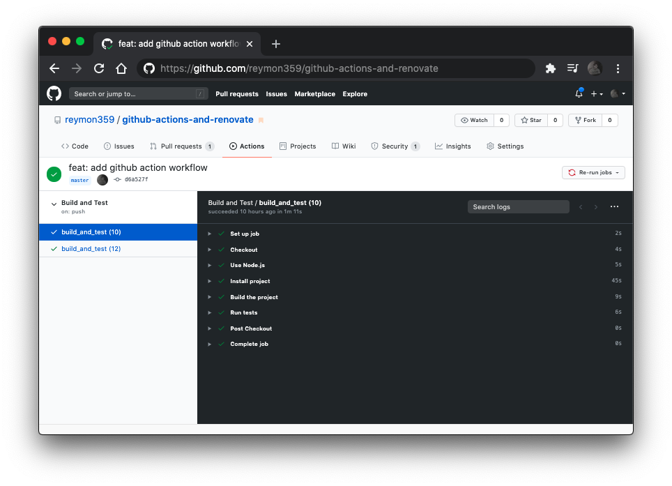

In Software Development **keeping up to date with technology updates** is crucial not only for developers who have to be always learning and renewing their set of skills but also for the projects they work on and have to be maintained.

When you start a project from the ground you normally set it up with the libraries' latest stable versions. Then time goes by, and the size of the project grows, new features are added, new libraries too, and **the version of the libraries and packages usually remains the same and almost never gets updated**. And yes, why would you update them if the project works perfectly with the current ones?


Here are some reasons why you should keep your dependencies updated:
 - Solving problems from old versions.
 - Adding vulnerability fixes.
 - Increase the overall performance.
 - Add new features from them. 
 - ...
 
 When you keep the dependencies updated you are solving problems from older versions, improving the performance with new optimizations, and you are also able to use new features that other developers added to them. All of these contribute to increasing the _maintainability of the code_, and the overall project.

We all have worked on projects where the dependencies have never (or rarely) been updated. 

So how do we do it? 

Well, first you can run `npm outdated` to [see the latest releases](https://docs.npmjs.com/cli/outdated) of the packages you are currently using.

You can then run `npm update` to update them (it will not update them to the major versions) but how do you know which ones will make the project break and which ones won't? 

Then there is the _when_, when should you update them? When should you check for updates? every day? every week? ...month?

This is why I made this project, to learn about GitHub Actions and use it to have a **safe way to automatically update the dependencies without making the project fail**.

The short explanation of this tutorial is about adding the [Renovate app](https://github.com/renovatebot/renovate) to check for dependencies updates and then submit Pull Requests to update them, this way we will _abstract_ ourselves on checking for updates, so we can focus on more important things. 

The point of using [GitHub Actions](https://github.com/features/actions) is to set up a workflow and trigger it with every Pull Request to check that the build and tests pass with the updated dependencies before adding them to the project.

## Table of Contents

- [Getting Started](#Getting-Started)
- [Set up GitHub Actions Workflow](#Set-up-GitHub-Actions-Workflow)
- [Add Renovate](#Add-Renovate)
- [Conclusion](#Conclusion)
- [Useful Resources](#Useful-Resources)

## Getting started

Although **this approach can be applied to any project** we will use a [React](https://reactjs.org) project made with [Create React App](https://github.com/facebook/create-react-app) as it will give us a basic project with everything ready to work on. By the way, if you do not have Node.js installed [here](https://nodejs.org/en/download/) is the link to do so.

Also, [in this repository is the resulting project](https://github.com/reymon359/github-actions-and-renovate) you will obtain after following all the steps below in case you want to have a look before starting.

So let's begin running

```bash
npx create-react-app my-app
cd my-app
npm start
```

If you use npm 5.1 or earlier, you can't use `npx`. Instead, install `create-react-app` globally:

```bash
npm install -g create-react-app
```

And then run:

```bash
create-react-app my-app
```

## Set up Github Actions Workflow

Now we will proceed to define a GitHub Actions Workflow in our repository to automate the process.

_[GitHub Actions](https://github.com/features/actions) is a Github Feature that helps your software development workflows automating from simple tasks to custom end-to-end continuous integration (CI) and continuous deployment (CD) capabilities in your repository._

In our root folder, we will create a new folder and name it `.github` and inside of it a `workflows` one. This is how your project should look after these steps:

```
📁 my-app
├── 📁 .github
│   └── 📁 workflows
├── ...
...
```

Here is where we will create and add our Workflows. Github Actions Workflows are the Continuous Integration automated processes we want to run in our project. 

Workflows are composed of jobs that contain a set of steps and to explain them in a clearer way let's create our own workflow explaining it step by step. 

In the `.github/workflows` directory, add a `.yml` or `.yaml` file and name it `main.yml`. I chose that name to keep things simple, but you can give it any other name like `build-test.yml` or `continuous-integration-workflow.yml`.

```text
📁 my-app
├── 📁 .github
│   └── 📁 workflows
│       └── 📄 main.yml
├── ...
...
```

[Here](https://gist.github.com/reymon359/514cf378456457f1798293fe0ed99f3a) is how the workflow will look in the end in case you just want to copy it and add it directly before the explanation.

```yml
name: Build and Test

on:
  push:
    branches: [master]
  pull_request:
    branches: [master]

jobs:
  build_and_test:
    runs-on: ubuntu-latest

    strategy:
      matrix:
        node: [10, 12]

    steps:
      - name: Checkout
        uses: actions/checkout@v2
      - name: Use Node.js ${{ matrix.node-version }}
        uses: actions/setup-node@v1
        with:
          node-version: ${{ matrix.node-version }}
      - name: Install project
        run: npm install
      - name: Build the project
        run: npm run build --if-present
      - name: Run tests
        run: npm test
```

The first param of our workflow will be its **name**.

```yml
name: Build and Test
```

The second param is the **trigger**. 

We can choose if the workflow is **triggered by an event like a push or pull request to a specific branch**, or we can even schedule a [cron](https://en.wikipedia.org/wiki/Cron) to **automatically trigger it every defined amount of time!**. 

In our project we will want to trigger it when pushing to the master branch and when the Renovate app submits a Pull Request to update a dependence:

```yml
on:
  push:
    branches: [master]
  pull_request:
    branches: [master]
```

Next, we define the **jobs**.
 
In this example, there will only be one job which will be the one to **build and test** the project, and chose the virtual machine where the job will be run on.

```yml
jobs:
  build_and_test:
    runs-on: ubuntu-latest
```

Then it comes to the matrix where we will configure the combination of versions and systems we want to run out Workflow. In our case, we will run it on Node.js 10 and 12.

```yml
    strategy:
      matrix:
        node-version: [10, 12]
```

Finally, the Workflow's steps. The first one is the [checkout action](https://github.com/actions/checkout) which is a standard action that you must include in your workflow when you need a copy of your repository to run the workflow.

Then you can run other actions and processes, in our app, we will use the **setup-node** action with the matrix we defined before. Then we will add steps to install the project, build it, and run the tests.

```yml
    steps:
      - name: Checkout
        uses: actions/checkout@v2
      - name: Use Node.js ${{ matrix.node-version }}
        uses: actions/setup-node@v1
        with:
          node-version: ${{ matrix.node-version }}
      - name: Install project
        run: npm install
      - name: Build the project
        run: npm run build --if-present
      - name: Run tests
        run: npm test
```

Now Create a GitHub Repository for the project, commit the local changes made, and push them to it.

Quick tip, If you want to create it faster go to [repo.new](https://repo.new) or [github.new](https://github.new). You can use [gist.new](https://gist.new) for gists too! 

Once you push your changes the Workflow will run, and you will be able to see how it went in the `Actions` [tab from the GitHub Project](https://github.com/reymon359/github-actions-and-renovate/actions).



## Add Renovate 

[Renovate](https://github.com/marketplace/renovate) is a free, open-source, customizable app to automate the update of our dependencies in software projects by receiving pull requests. It is used by software companies like Google, Mozilla, or Uber and you can use it on GitHub, Gitlab, Bitbucket, Azure DevOps, and Gitea.

Going to the point what we will do is add a bot that will submit pull requests to our repository when there are updates in our project dependencies. 

The cool thing, and the whole point of our project, is that we have previously defined in our workflow to run the tests with the pull requests so when renovate submits one **we will automatically check if the updates proposed will break the project or not before merging them to the master branch**. 


To add Renovate to our project we have to install [its app](https://github.com/apps/renovate) into the project's repository. Be careful when selecting the repository you want to add Renovate to and choose the one created before. If by mistake you want to reconfigure it you can do it in the [Personal Settings' Applications tab](https://github.com/settings/installations) from your account. 

After some minutes we will have to accept and merge the onboarding Pull Request that we will receive.

Once we have it integrated we will configure it updating the `renovate.json` file on the project root. Remember to pull the changes after merging the Pull Request for it to appear. 

We can use the default configuration where renovate will submit the pull requests whenever it finds out about updates and wait for us to merge them:

```json
{
  "extends": ["config:base"]
}
```

Or we can adapt it to the requirements of our project like [the one used by Renovate itself](https://github.com/renovatebot/renovate/blob/master/renovate.json). To avoid falling short and to learn a little more about the tool, we will use a configuration with some of its most useful features. If you want to learn more about its configuration [here](https://docs.renovatebot.com/) are the docs for it.

[This](https://gist.github.com/reymon359/4c4417522cd0922cfbc63ad75ca2c945) will be our `renovate.json` file. Have a look at it and I will explain it after.

```json
{
  "extends": [
    "config:base"
  ],
  "packageRules": [
    {
      "updateTypes": [
        "minor",
        "patch"
      ],
      "automerge": true
    }
  ],
  "timezone": "Europe/Madrid",
  "schedule": [
    "after 10pm every weekday",
    "before 5am every weekday",
    "every weekend"
  ]
}
```

In the first part, we are telling renovate that our configuration will be an extension from the default one.
```json
{
  "extends": [
    "config:base"
  ],
```

Then we have the `packageRules`. After some months using it I realized that going (from time to time) through the pull requests checking and accepting them if the tests passed was a major waste of time. This is why the `automerge` is set to true, so Renovate automatically merges the pull request if the workflow passed successfully. 

To restrict Renovate's freedom a bit, we define that he only can perform the `automerge` when it is a `minor` or `patch` update. This way, if it is a `major` or another kind of update, we will be the ones to check whether that update should be added or not. 

[Here](https://docs.renovatebot.com/configuration-options/#updatetypes) you can find more information about the update types available.

```json
  "packageRules": [
    {
      "updateTypes": [
        "minor",
        "patch"
      ],
      "automerge": true
    }
  ],
```

Lastly, we have the time schedule. If you work alone or in a team at certain hours it is nice to have the updates done at times when you are not working to avoid unnecessary distractions.

We select our timezone and add a custom [schedule](https://docs.renovatebot.com/presets-schedule/) for it. You can find the valid timezone names [here](https://en.wikipedia.org/wiki/List_of_tz_database_time_zones). 

```json
  "timezone": "Europe/Madrid",
  "schedule": [
    "after 10pm every weekday",
    "before 5am every weekday",
    "every weekend"
  ],
```

Anyway, if you do not care about the time the pull requests will be submitted, or the people that contribute to the code are in different timezones then you can remove this part.

Once we have updated the configuration we push the changes to GitHub to have the Renovate app adapted to the new configuration. 

Now you finally have the project dependencies safely up-to-date without you having to check for them. [Here is the resulting project](https://github.com/reymon359/github-actions-and-renovate) after following all the steps mentioned above.

Remember that if you added the time schedule part you will not get the pull request merged automatically until it complies with that configuration.

## Conclusion

Although there are other ways to keep the dependencies updated in an automated way if you use GitHub to host your code you should take advantage and make the most of its awesome free features. 

If you are wondering what else you are able to do and automate with the GitHub apps and actions just have a look at its [Marketplace](https://github.com/marketplace).

In addition, you can have a look at [a project I made](https://github.com/reymon359/up-to-date-react-template) where I am working on from time to time and on which I based myself for this tutorial. It is a bit more complex and has more features than the one from this tutorial.

I hope you enjoyed the tutorial and learned about GitHub Actions and its Apps. If you've got any questions, suggestions, or feedback in general, don't hesitate to reach out on any of the social networks from [my site](https://ramonmorcillo.com) or <a ref="mailto:hey@ramonmorcillo.com">by mail</a>.

## Useful Resources

Here is a collection of links and resources which I think can be useful to improve and learn more about GitHub Actions and Apps.

- [Tutorial project](https://github.com/reymon359/github-actions-and-renovate). - The resulting project from this tutorial.
- [GitHub Marketplace](https://github.com/marketplace). - The place to find all GitHub Actions and Apps.
- [GitHub Actions Workflow Configuration](https://help.github.com/en/actions/configuring-and-managing-workflows/configuring-a-workflow) - The full documentation on how to set up a workflow on Github Actions.
- [Renovate GitHub app](https://github.com/marketplace/renovate) - The Renovate App main page on the GitHub Marketplace.
- [GitHub Actions project Workflow](https://gist.github.com/reymon359/514cf378456457f1798293fe0ed99f3a). - The Workflow used in this tutorial.
- [Renovate App's configuration file](https://gist.github.com/reymon359/4c4417522cd0922cfbc63ad75ca2c945). - Renovate App's custom configuration file from the tutorial.
- [Up to Date React Template](https://github.com/reymon359/up-to-date-react-template). - A Personal project that uses the approach described in this tutorial.

