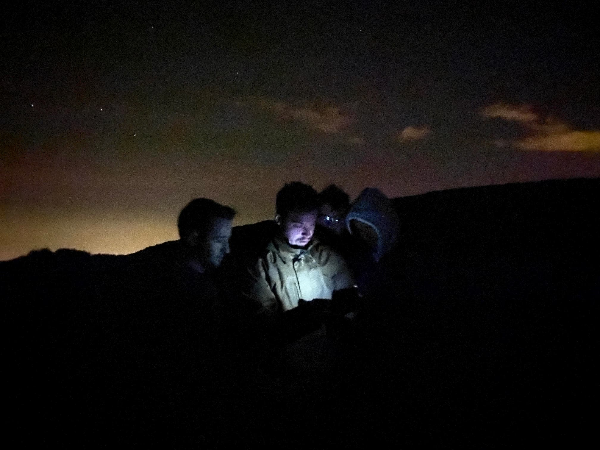
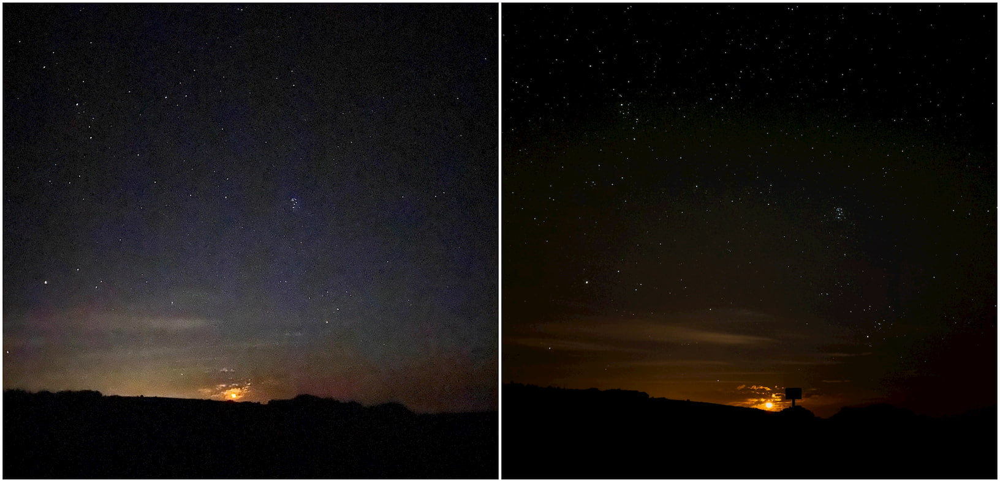

Some time ago I was living in the Canary Islands, a group of islands well-known for having one of the clearest skies in the world. Amazed by the stars views my housemates and I spent some nights stargazing.

Those were not my first nights contemplating the stars on a clear sky, but the fact of **capturing them contributed more to enjoy the moment.** I always thought this kind of activity was just for professional photographers but **after understanding some concepts even someone with no experience can enjoy it and take awesome pictures.** 

 Aperture ƒ/1.7, Shuter Speed 30s, ISO 2000](./the_milky_way_over_the_teide.jpg)

I will share what I learned so anyone can experience it too. Be advised that I am no professional photographer and that I will explain technical concepts in a _simpler_ way as this article is addressed to beginners.
   
## Table of Contents

- [The Location](#The-Location)
- [The Device](#the-Device)
- [The Exposure Triangle](#The-Exposure-Triangle)
    - [ISO](#ISO)
    - [Aperture](#Aperture)
    - [Shutter Speed](#Shutter-Speed)
- [Conclusion](#Conclusion)
- [Acknowledgments](#Acknowledgments)

## The Location

Nowadays **because of the cities’ light pollution, these are not the best places for this activity.** Therefore the further you are from them the better to have a clearer sky. The [Bortle scale](https://en.wikipedia.org/wiki/Bortle_scale) is a nine-level numeric scale that measures the night sky's brightness.

.](./light_pollution_in_the_bortle_scale.jpg)

## The Device

**You don’t need an expensive camera, or a night mode one** to have fun and take decent pictures. The majority of phones have a mode that lets you adjust the settings for the shot. 

Remember to **have the device in a fixed position while taking the photo.** Don't even consider holding it with your hands. Although you don't need a tripod it will help you for this purpose.

## The Exposure Triangle

The most important thing to understand is how to play with the amount of light, or rather, the lack of it. You will have to **adjust your camera settings more than once to get the right amount of light from the environment for the shot when there is almost none.** 

For this purpose, there are three main settings you will have to adjust: **ISO, Aperture, and Shutter speed.** The Exposure Triangle is a graphic representation of them and how they work together.

](./exposure_triangle.jpg)

### ISO

This is the **sensitivity level of your camera to light.** The higher the sensitivity level the more light (artificial) you will get. However, you will get more _noise_ which appears like grain in the picture.

### Aperture

This one regulates the **amount of light** that reaches the sensor. The smaller the aperture size, the less light you will get. It also controls the **depth of field** which the smaller the aperture the wider it will be and the less blurry stars’ pictures.

### Shutter Speed

It controls the **shot duration,** in other words, how long the sensor is capturing light. The longer the shutter speed the more light will enter. If you have set the aperture to the minimum you won’t get too much light, therefore, you will have to increase the Shutter speed to spend more time capturing light for the shot.

## Conclusion

To capture the stars you should **set the aperture (if your device allows you) to the minimum to not get blurry images.** Then experiment with the ISO and Shutter speed. Remember that if you increase the ISO although you will have to wait for less, it will have more noise. Therefore, **the best approach is to increase the shutter speed (time taking the shot) to get the most quantity of light without noise.** 

Here is an example where the first picture has a higher ISO (8000) and was taken with a shutter speed of 1 second and another where the ISO is lower (800), and a shutter speed of 15 seconds. You can see that there is more noise (grain) in the first one.

Another comparison of three photos of the [Teide](./../how-to-enjoy-the-sunrise-from-the-top-of-spain) National Park at night. Although all of them have the same aperture of ƒ/1.7, changing the ISO, and the Shutter speed gives you totally different photos.

- Left. ISO 14600 and 1/3 sec. Shutter speed.
- Center. ISO 1600 and 30 sec. Shutter speed.
- Right. ISO 400 and 30 sec. Shutter speed.

By the way, the white lights are people climbing it with lanterns. You can appreciate how their trail increases with the Shutter speed.

At first, it seems complicated and hard to understand, or at least to understand the minimum to get a decent shot. However, with these concepts and practice, getting stars’ pictures becomes enjoyable and fun. 

## Acknowledgments

Acknowledgments to my housemates and my friend Unai who taught me these concepts in the first place. By the way, the cover photo is from one of those nights.

To end, you can edit the photos later to make them look better. Here is an edit Unai made with one of them.

 edited.](./the_milky_way_over_the_teide_edited.jpg)
