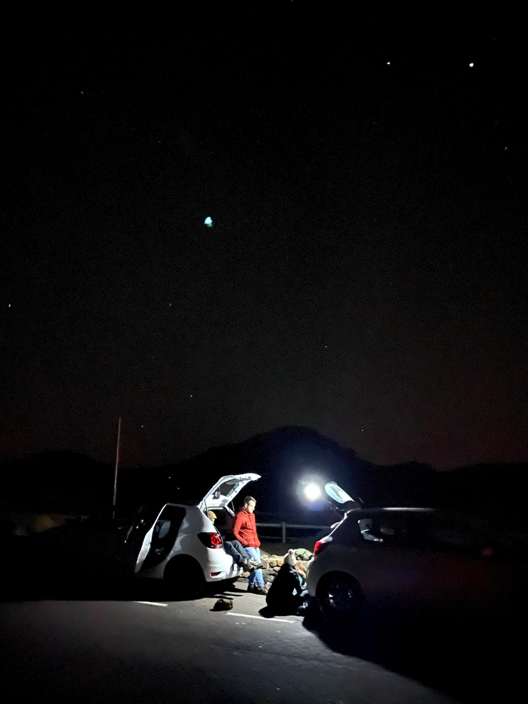
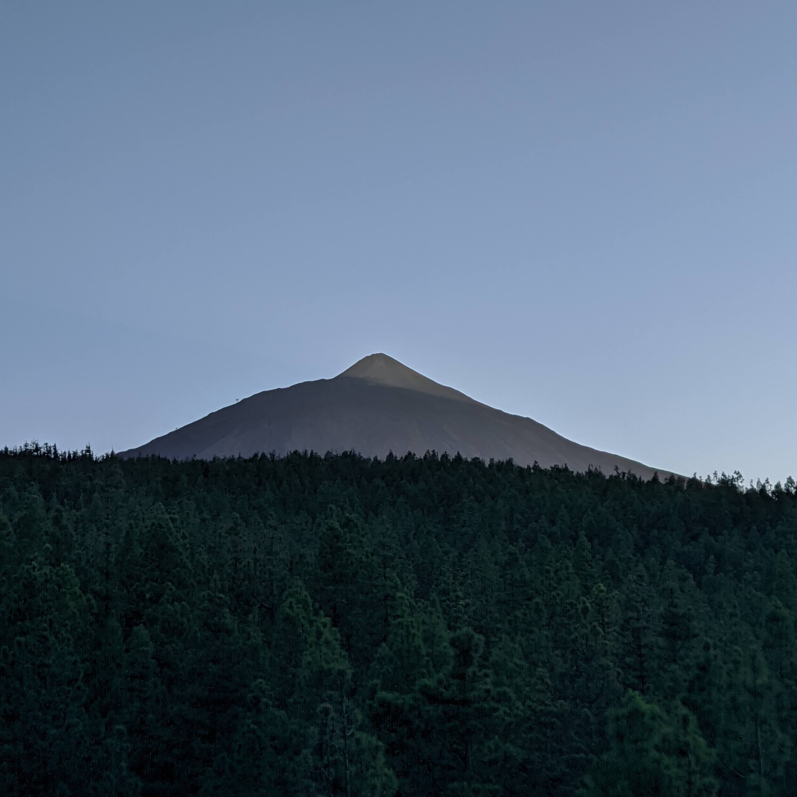
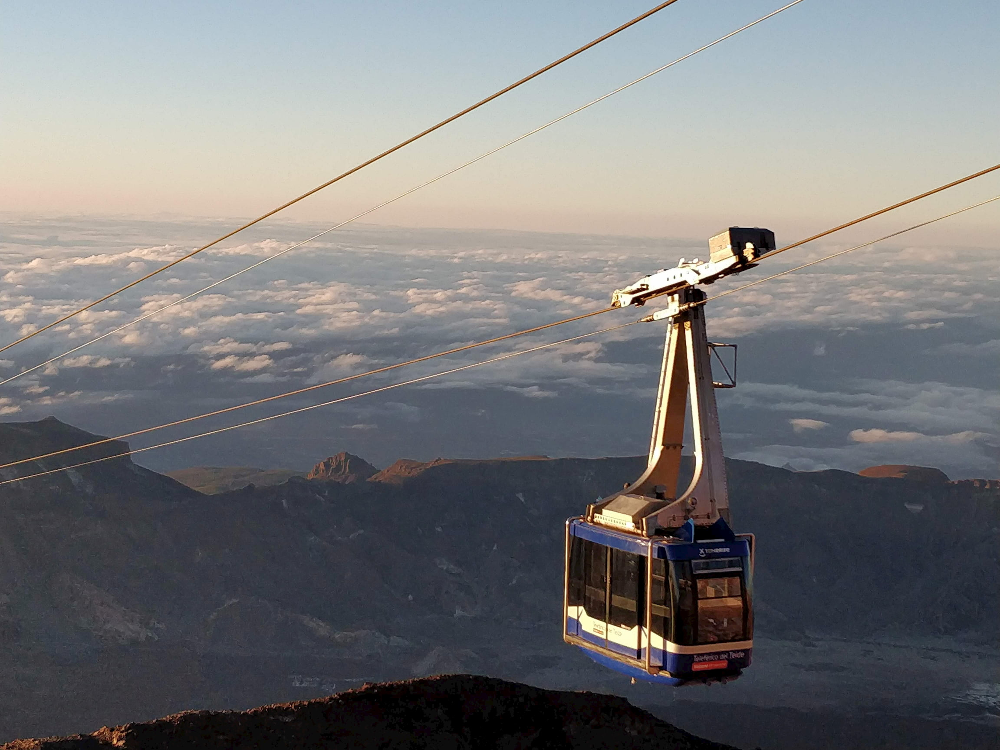
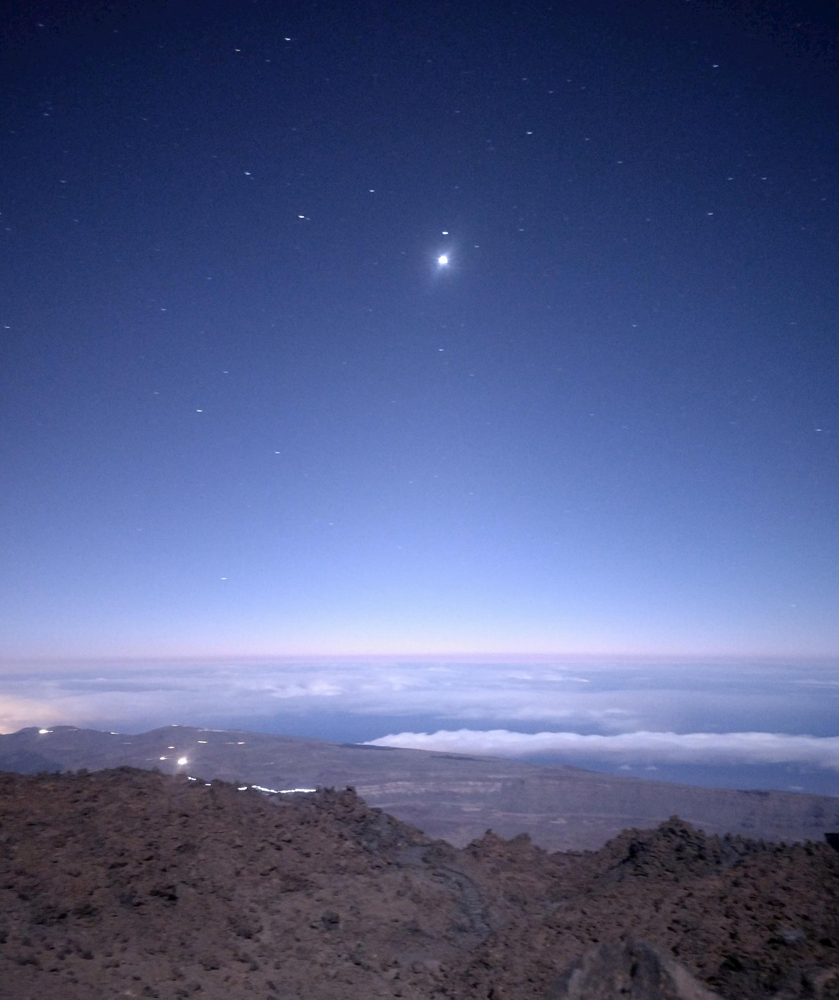
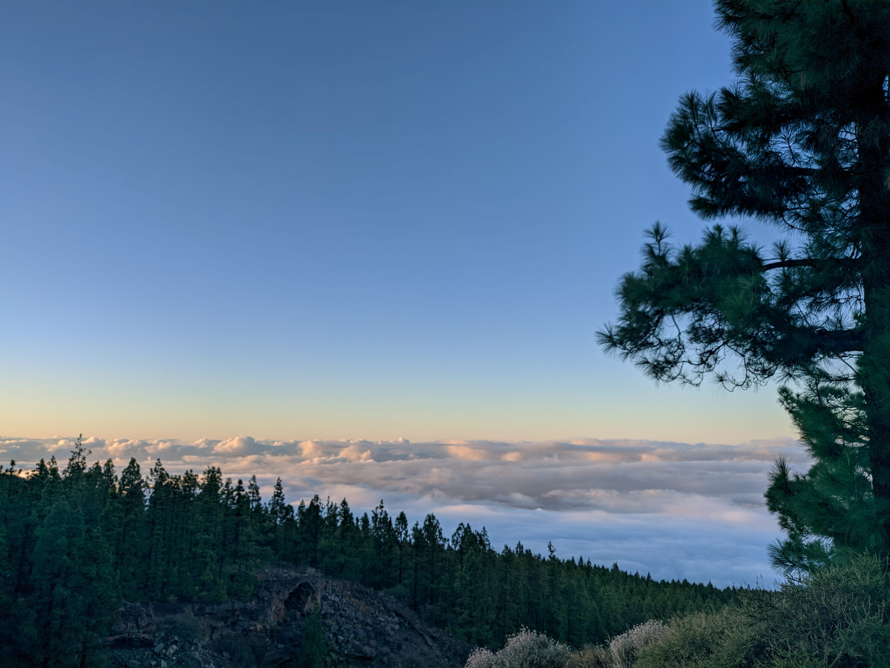

Last month some friends and I made it to the **Teide’s summit (3.718 m) at night** to enjoy the sunrise from it. The experience was probably one of the best I have had in life and after being asked multiple times how we did it (route, clothes, timings, ...) I decided to explain it here for anyone interested in doing it. By the way, I added a [TLDR version at the end of the article](#TLDR) in case you don’t want to read all of it.

We were a five people group, a good number to stay close enough during the hike and not spread out. Remember this is not a normal hike given the fact of doing it at night so, even if you are in good shape **it can be tough for casual hikers.**

## Table of Contents

- [Basic information](#Basic-information)
- [Before the Hike](#Before-the-Hike)
- [The Route](#The-Route)
    - [Getting to the starting point](#Getting-to-the-starting-point)
    - [Montaña Blanca](#Montaña-Blanca)
    - [The Peak](#The-Peak)
    - [Taking the cable-car down](#Taking-the-cable-car-down)
- [Greetings](#Greetings)
- [Resources](#Resources)
- [TLDR](#TLDR)

## Basic information

Some things you must know about the adventure:

- As said in the title, the Teide is the **biggest mountain in Spain** with a high of **3718 meters.**
- About the hike, the distance is around **8 km** with a very steep slope including **gradients of up to 60%** and takes about **5.5 hours** on average. The start point altitude is 2348 m so, the **elevation gain is 1370 m.**
- In case you are thinking of doing it by daytime, you’ll need **permission to hike it from 9 am until 6 pm.** You automatically get permission to hike up the tip If you plan to stay on the refuge.
- There is a **cable car,** but it **does not run on windy days.** Take it into account because you may end up hiking it down too.

## Before the Hike

Check the **weather**. This includes temperature, wind, and precipitation. [On this site,](https://www.volcanoteide.com/es/teide-hoy) you can have a look at the Live forecast of the Teide and its paths. It will be very cold, so you will need appropriate clothing. You should dress up with **winter clothing** which means gloves, and a hat at least.

Buy the way down **cable-car ticket (13 euros)**. After the effort made hiking it you will take the cable car to reach the base. Make sure to buy it and don’t forget to bring it with you.

Get your body and mind used to **staying up late**. I normally go to bed and wake up early, changing my normal schedule and staying up until very late the days before the hike helped me that night. Besides, drinking **coffee** and/or tea before and during the hike was a great idea to fight sleep.  Prepare some flasks full of it and obviously, do not forget **water and food** for the hike.

**Extras**

Check the calendar for the next **full moon**. When climbing Teide that night or a nearby one the landscape views were beautiful, and we didn't need a flashlight. The negative point is that we couldn't see the stars properly. However, you can see them every night from any high spot on the island. Thus said, the night landscape views from the Teide are obviously better while full moon.

If you can afford it, try to **drive there in more than one car.** The path does not begin where the cable car drops you off. You will have to walk back to where you parked the car at the beginning of the trail unless you have a second car. Therefore, the _trick_ is to leave one of them in a car park near the cable-car Base Station before heading to the starting spot with the second car. This way **when you get off the cable car exhausted you won't have to walk another 40 min** to get to the car.

Is a good idea to spend some hours at the base before the adventure. We got to the starting point late in the evening to have a picnic dinner and start **getting used to the high altitude hours before the hike.** This will help you to prevent [altitude sickness.](https://en.wikipedia.org/wiki/Altitude_sickness)

## The Route

](./full_route_infographic.jpg)

### Getting to the starting point

**The trail begins at path 7 - Montaña Blanca (2.320 m).** We got there from _La Orotava_ following the signs that led us to the Teide. At some point, you will get over the level of the clouds, do yourself a favor, and stop to contemplate **the sea of clouds.**

A while after you will notice the lack of vegetation on the landscape which means you are entering the Teide National Park.

If you go in one car **head to the beginning of the Montaña Blanca path** and wait there until beginning the ascension. If you manage to get two cars, keep driving until the cable-car Base Station and leave one in the car park near it. Then go back with the other car to the Montaña Blanca starting point. Here you’ll have to **wait until around 1:00 am to begin.** 

### Montaña Blanca

Lorem ipsum

### The Peak

Lorem ipsum

### Taking the cable-car down

Lorem ipsum

## Greetings

Lorem ipsum

## Resources

Lorem ipsum

## TLDR

Lorem ipsum
	
