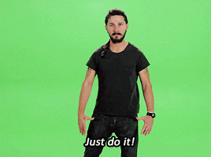

In the last few years, I have been improving the way I organize myself to get things done. It started with a humble to-do list, and now I have reached a point where the method is complex enough that I spend excessive time explaining it to others when they ask me about it. Hence, the reason I am writing this article. 

Any system is good enough if you manage to get things done with it. All the same time, everything can be improved. This is the method I use, which I hope will help you to be more productive.

I added diagrams along the lecture to understand it better. There is a cheat sheet including all of them in the resources section.

## Table of Contents

- [Achieving Goals](#Achieving-Goals)
  - [From Year Goals to Daily Work](#From-Year-Goals-to-Daily-Work)
  - [Bigger goals and uncertainty](#Bigger-goals-and-uncertainty)
- [Managing tasks](#Managing-tasks)
  - [Filling the bucket](#Filling-the-bucket)
  - [Emptying the bucket](#Emptying-the-bucket)
  - [Adding a task to the Calendar](#Adding-a-task-to-the-Calendar)
    - [Priority](#Priority)
    - [Recurrence](#Recurrence)
- [Automatize](#Automatize)
- [Diversify](#Diversify)
- [Review](#Review)
- [Conclusions](#Conclusions)
- [Resources](#Resources)
- [Acknowledgments](#Acknowledgments)

## Achieving Goals

> “There is only one way to eat an elephant: a bite at a time.” - Desmond Tutu

Everything you want to achieve in life, especially big goals, may seem overwhelming at first sight. However, they can be accomplished by doing a bit of them over time.

That's the simplest trick to accomplish any goal. Split them into smaller ones until you have objectives that can be measured and estimated properly. _Objectives you can work on._

### From Year Goals to Daily Work

Beginning each year, review the past one and make a list of what you want to accomplish on the upcoming one. These will be the Year Goals.

Each month, follow-up on how the year goals are coming along and which ones need more time and priority to get them accomplished. Remove or change them if needed/wanted. Then split them into Achievable Goals.

Have a look at the Achievable Goals each week (I usually do this on weekends) to see how they are going, and create Weekly Goals to progress towards them. At the same time, check if the Weekly Goals from the past week have been accomplished or not. Then plan next week’s goals to work on.

When reviewing and planning each week, assign a priority to the goals. This will help you focus on what is more important or urgent.

Be realistic. Plan the week according to the time and activities you will have. If you are on holiday or sick, the amount of time and effort you can spend will be different from a more normal week.

Each day, dedicate a couple of minutes to see how the weekly goals are coming along. Plan the next day depending on their progress and priority.

For example, if you want to read more on a certain year, you can set up a Year Goal for reading X books. Afterward, create an Achievable Goal, such as to read a book. Then break it down into Weekly Goals like reading X pages or X chapters. Lastly, each day, have a look at what you will focus on the day after towards completing your Weekly goals. It could be reading for 2 hours or just 30 minutes. It depends on how the goal is coming along and if there are others with more priority that need more time.  

With repetitive ones, you can try to automate them and set up reminders for them. This way you won't forget about doing them. 

### Bigger goals and uncertainty

More than once, I have tried to set up long-term goals for what I want to accomplish in life. It is already hard to handle the uncertainty from a single year, and therefore going beyond the year involves even more uncertainty. 

I have realized that what I want to achieve in the long term changes frequently. Therefore, the amount of uncertainty is too high to handle and to plan towards it. Consequently, I mostly focus on working towards realistic year goals. I do have long-term goals for _the future,_ however, I rather work on _the present_ ones. 

Reviewing the goals frequently will make you more aware of how your objectives are coming along and will reduce the amount of uncertainty.

## Managing tasks

Life is constantly giving you tasks to complete and issues to solve. To deal with them, I developed a system, which I keep reviewing and improving.

Apart from the tasks obtained from splitting the main goals into smaller and smaller objectives, others come from day-to-day circumstances such as work, social commitments, or primary needs like buying groceries.

### Filling the bucket

Add all these tasks that come from different inputs to a **Task Bucket.** The Task Bucket should be easy to use to quickly add tasks to it. Besides, the more accessible it is at any moment, the better. A simple to-do list will work for this purpose.

Before adding the task, ask yourself if you can complete it at the moment (less than 5 min), and if that is the case, just do it.

Here are some motivational words from Shia LaBeouf about this topic

### Emptying the bucket

To empty the Task Bucket involves moving the tasks to a tool where they can be managed. As tasks are done primarily with time, we need a tool to manage tasks across time. I call this instrument a **Task Calendar**. The tool you use as a task calendar should allow you, at least, to allocate tasks in time and give them a priority. A calendar or notebook agenda, physical or digital, should work. 

Each time you select a task from the bucket, ask yourself:

- Is it still worth doing it? If not, **remove it.**
- Is it your responsibility to do it? If not, **delegate it.**
- Can it be done in 5 minutes or less? If yes, **just do it.**

Remember Shia's words

Therefore, add a task to the calendar when:

- It is worth doing.
- It is your responsibility.
- Cannot be done in 5 minutes or less.

### Adding a task to the Calendar

When adding tasks to the calendar, give them a **priority** and make them **recurrent** if they will be repeated over time.

#### Priority

When giving priority to a certain task, follow these simple criteria:

- Priority 0: It definitely has to be done today.
- Priority 1: It is required / has to / should be done today
- Priority 2: It doesn’t mind if it gets done today or not. Do it when Priority 0 and 1 tasks are done.

Some examples could be:

- Priority 0: Empty the Task Bucket.
- Priority 1: Buy groceries.
- Priority 2: Research something you are interested in.

Keep in mind, these examples vary from one individual to another. You may give more priority to a certain task than other people.

#### Recurrence

If a task repeats over time, make it recurrent. Set up reminders or alarms for it. If your calendar tool does not allow you to do it, do it your own way or find another tool. For example, add a note/task such as “When done, create a new one for the next time”

Examples of recurrent tasks that could have reminders:

- Monthly reminder: Review year goals
- Weekly reminder: Plan next week
- Daily reminder: Empty the Task Bucket

Remember to not be too strict with your priorities. It is crucial to review and update the tasks when requirements change. Adjust the priority or postpone them if needed.

Keep in mind you can remove them as well. It makes no sense to have a task on the calendar that no longer needs to be done.

## Automatize

Our brains are limited by the amount of content we can put into them. Thankfully, we live in an age where it is easier than ever to abstract ourselves from remembering important things. Don’t try to remember all you have to do by yourself. 

Take notes and set up reminders. Use alarms and calendar reminders with auto-repeated events. Whatever works better for you. 

The goal is to automate everything that can be done automatically, to spend your time without worrying about it, and focus on what really matters.

Examples of tasks that are repeated, therefore, should be automated, and reminders set up for them:

Daily:

- Empty the Task Bucket
- Plan the next day

Weekly

- Clean your laptop’s downloads folder
- Plan the next week

Monthly

- Review your year goals progress
- Contact your closest ones

## Diversify

Don’t focus on a specific domain when setting up goals. Life is more than a career or a project. 

Set up goals on domains such as health, social relationships, exploring, work, finances, or whatever topic you want to improve at.

This obviously means splitting those goals into smaller ones. For example, if you want to improve your health, you can set up goals like getting more fit, which can end in weekly objectives such as exercising X times per week or eating X healthy meals. If you want to explore more, set up a yearly goal of visiting X new places or countries. 

## Review

The hardest part of this system is getting started with it. Do not try to have a perfect way to organize yourself from day one. Focus on having something that works. 

Once you reach this point, review it from time to time. Check what is working and what isn’t. Look for ways to improve it.

Ask yourself these simple questions every time you review your system:

- What is going well? Keep doing it
- What is not going well? Stop doing it
- What can be improved? Try new ways to do it better

I started with a simple to-do list years ago, at some point bought a notebook, and then moved to a calendar app. Thanks to reviewing my system, I started adding features to it like priorities to focus better on what to complete first, and reminders to not forget anything.

## Conclusions

Find a system that works better for you. A to-do list or a notebook are a great starting point for most people. Remember, the most important and hardest part is _getting started._

In case you had forgotten him

Once you get used to working with it, review it and look for new ways to be more efficient.

If anything from this article is useful for you, don’t hesitate to apply it. And if you are still considering it, just give it a try.

Keep in mind, this is just how I am particularly organizing myself at this moment. It may change as I keep reviewing and improving it. With it, I am helping other people get better or maybe just get started.

## Resources 

Here are great techniques and tools to help you manage your time and prioritize tasks.

- **Eisenhower Matrix.** A great method for setting priorities and goals. Use it from time to time to evaluate your current task and overall progress. [More info.](https://reymon359.github.io/how-to-live/#/The%20Eisenhower%20Matrix/index)
- **Pomodoro Technique.** A time management method that uses a timer to break work into intervals, traditionally 25 minutes in length, separated by short breaks.
- **Eat the Frog.** A technique, which recommends you to complete the hardest task first.  Giving you a strong sense of achievement by doing it and focusing on more enjoyable projects later.

[Here](https://reymon359.github.io/how-to-live/#/./Categories/Productivity) is useful advice about productivity, which I wrote in the past.

I made a cheat sheet with the most important points from the article.

And finally Shia’s [motivational video](https://www.youtube.com/watch?v=ZXsQAXx_ao0) 

## Acknowledgments

The system I describe in this article is a mix of habits I have been adding and improving.

I learned most of them from amazing people such as David Roncero and books like The 7 Habits of Highly Effective People or Atomic Habits.

Besides, from Software Development books and Agile practices such as Retrospectives.
