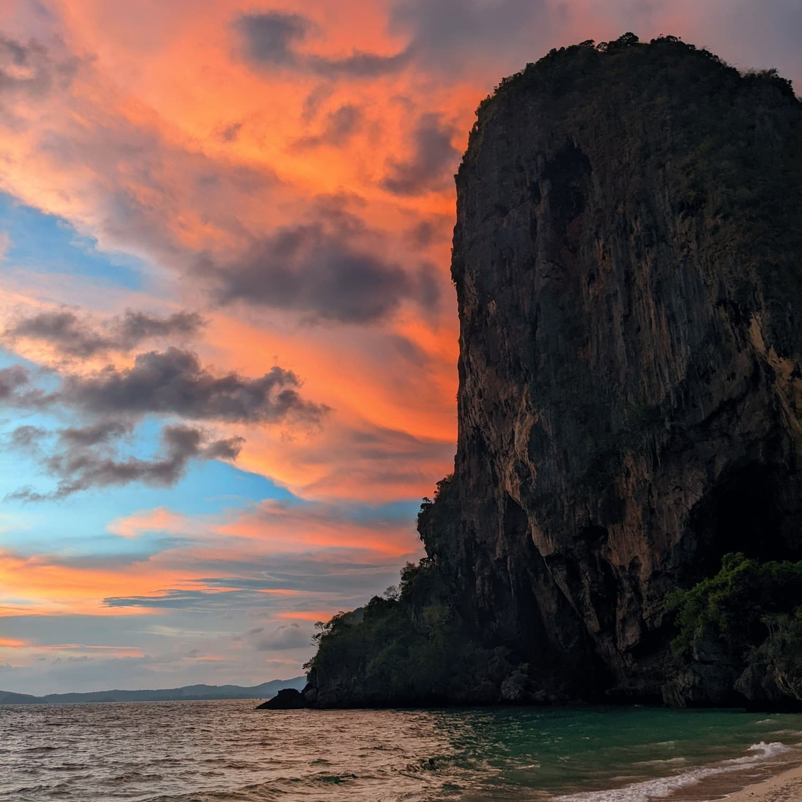

These are just a couple of words I want to share in case I die of sudden death. I am healthy and would love to keep enjoying life for more years. However, accidents happen, and the last adventure could be around the corner.
 
This is addressed to the important people in my life, and anyone who cares about me. I firstly want you to know that it's fine that I am no longer here.

## A bit about my life

I want to express how grateful I am for the life I have had. I feel lucky to have been born in a developed country, an experience not everyone in this world can relate to. 

Not only that, I am also grateful for all the moments I lived in my years of growth (the good and the bad ones) that made me become more aware of who I am. 

I have also been able to live a [digital nomad life](https://ramonmorcillo.com/lifestyle-as-a-digital-nomad-staying-in-colivings/) for the last few years, which has brought me so much fun and adventures while getting to know amazing friends from all over the world. 

At some point, I felt some kind of fullness in life, not that I had found a purpose or meaning, but that I found a way of living I truly enjoyed and wanted to keep living.

Actually, the facts above and other thoughts were the precursors to my [How to Live](https://reymon359.github.io/how-to-live/#/) project. Although my opinion on some subjects from it have changed, the fundamentals and purpose remain almost the same

Before moving to other topics, regarding the meaning of life, [here is an article](https://moretothat.com/the-meaning-of-life-is-absurd/) I recently read whose point of view I agree with the most. Hope you find it helpful.

## How I would like to die 

This may be the best opportunity I have to address this subject, so let’s go. 

One of my favorite movies is Big Fish, and definitely the part I like the most about it is the ending. When he arrives at the river and everyone is there, joyful to celebrate his farewell and see him again one last time. 

If I could choose how to leave the world, it would be in the same way. I would reunite
all the people I interacted with in my life, to a greater or lesser extent. And meeting once again at a big feast party (One Piece post arc style) to exchange the last good moments.

And then, there is the question of what to do with my body. As of today, I don’t really care what happens to it, as I will not be able to care for anything when dead. 

Being properly preserved and then being awakened in the far future would be awesome (although I believe it will not be available in my lifetime).
I would be pleased to behold how incredible the world of the future is going to be with all the technological advances.

## My feelings regarding death

## The purpose behind this article

## Greetings
