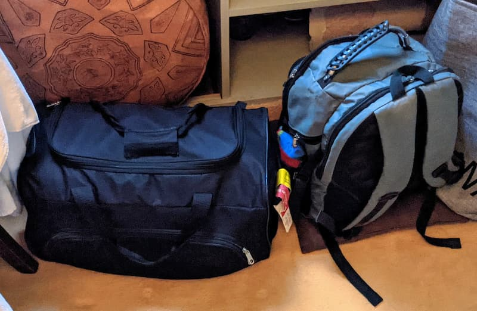

Here I will share my experiences living as a digital nomad while staying mostly in Colivings. After being asked multiple times about the topic, the aim of this lecture is to help other people have a better idea of this lifestyle.

I will explain first the concept behind _Coliving_ and _Digital Nomad._ Adding my point of view and experiences. In the end, I will share several **conclusions** and **useful resources.**

## Table of Contents

- [Coliving](#Coliving)
  - [Characteristics](#Characteristics)
  - [Price](#Price)
  - [Stay](#Stay)
  - [Community](#Community)
- [Digital nomad](#Digital-nomad)
  - [Why did I decide to embrace this lifestyle?](#Why-did-I-decide-to-embrace-this-lifestyle)
  - [My opinion and what I learned from it](#My-opinion-and-what-I-learned-from-it)
- [Coronavirus](#Coronavirus)
- [Conclusions](#Conclusions)
- [Resources](#Resources)
  - [Traveling](#Traveling)
  - [Covid-19](#Covid-19)
  - [Colivings](#Colivings)
  - [My map](#My-map)
- [Acknowledgments](#Acknowledgments)

## Coliving

> Co-living is a residential community living model that accommodates three or more biologically unrelated people.Generally coliving is a type of intentional community that provides shared housing for people with similar values or intentions. The coliving experience may simply include group discussions in common areas or weekly meals, although will oftentimes extend to shared workspace and collective endeavors such as living more sustainably. - [Wikipedia](https://en.wikipedia.org/wiki/Co-living)

Although that definition from Wikipedia is right, the kind of colivings I have been had other amenities in common such as a coworking place, a proper wifi network, shared meals, or community activities among others.

These places don’t fit in the known categories of a hotel, neither an Airbnb nor sharing a flat. 

While looking for accommodations in Tenerife with a proper area to work, I found about Nine coliving. That’s when I discovered this whole new concept for living.

### Characteristics

Right now, after coronavirus and the increase of remote working, more and more colivings are appearing. However, not all of them are the kind of coliving I have had the chance to live in. A big part of them are just big companies owning entire buildings that offer a coliving experience but end up being nothing more than sharing a flat.

 shared kitchen and coworking](./assets/nine_coliving_shared_kitchen_and_coworking.jpeg)

The colivings I have been share at least these characteristics:
- A **coworking** area to work in a productive environment. Including a decent Wifi connection, video call areas, and 24h availability in case you need to work in a different timezone.
- **Shared common areas** such as a kitchen or living room where you interact, cook, and enjoy meals with others.  Probably the most important one.
- A variety of **activities,** from yoga or hiking to sharing-skills meetings, or going out for drinks. Depending on what the community is up to. And depending on the location; It's a bit hard to go surfing when you are in the middle of Germany.
- A **community** you share the place with. You live with ten residents, more or less, depending on the coliving accommodations. They normally share similar interests while having different backgrounds, which gives you new points of view. Thanks to this community, you don't have to look for new friends when arriving at a new location.

### Price

The price of the coliving depends on the kind of accommodation you book. A three-people shared room will be cheaper than a single room with a private bathroom (if they have this kind of room). It also depends on the amount of time you stay, normally the longer you live there the cheaper it gets.

A great advantage of colivings is the release of paying monthly bills for electricity, gas, water, or wifi. All of them are included in the price, and you don’t have to waste time and effort worrying about them. 

### Stay

The time people spend in these locations varies on the coliving rules and the traveler situation. Most colivings encourage longer stays enforcing a minimum booking time or discounts for longer stays. Others don’t have staying restrictions and, although it's quite unusual, people may be there for just a weekend.

### Community

In my opinion, this is the best aspect. The people you meet in these places come from all around the globe. Therefore, you not only learn about the place you stay but about other countries, professions, lifestyles, languages, etc. Every human is a whole world, and meeting such random people opens your mind to new possibilities in life you didn’t even imagine. 

Another advantage is having people to do plans with. Plus, you connect with them in a more meaningful way.

> Ironically, I feel that I connect much deeper and much quicker with people when on the road, than with people "back at home". When you live with someone 24/7 in a coliving space in a foreign country & go on a desert trip with them, this is much deeper than living in separate apartments in the same city and meeting every now and then for a regular dinner. Both; the quantity of time & the depth of the experience itself is much more intense. - Tobias Hug

Most of the people I met were digital nomads, however, other people used to live here along, such as the hosts, locals, or just travelers. Speaking of locals, sometimes coliving spaces can feel like “foreigners bubbles” when colivings and colivers don’t make the effort to integrate with them.

Although living with a lot of people may seem overwhelming, you can have privacy when you want to have time for yourself. This is the opposite issue of the standard digital nomad who travels mostly alone and has to make an effort to meet people.

 in Imsouane Beach, Morocco](./assets/about_to_catch_great_waves_with_friends_from_sun_desk_in_imsouane_beach_morocco.jpeg)

## Digital nomad

In a very simple way, a digital nomad is someone that works via the internet, and therefore, they can work remotely from any place with a proper connection. 

Actually, this definition from Wikipedia is quite accurate:

> Digital nomads are people who use telecommunications technologies to earn a living and conduct their life in a nomadic manner. Such workers often work remotely from foreign countries, coffee shops, public libraries, co-working spaces, or recreational vehicles. The most common types of digital nomads include retired or semi-retired persons, independently wealthy or entrepreneurs, and (often younger) remote workers. People typically become digital nomads for many reasons, including the quest for financial independence and a career that allows for location independence. - [Wikipedia](https://en.wikipedia.org/wiki/Digital_nomad)

Although most people I have met had a laptop (or similar) to work with, this doesn’t mean all of them were doing a job associated with web development, digital marketing, or similar. Many had jobs where they used a computer to get tasks done like filling reports, sending files, or attending meetings.

Others didn't even have a job, like students who attended online classes and completed their homework.

Besides, I met people without a computer, doing independent location jobs such as cookers, volunteers, yoga teachers, etc. I guess they would be out of the digital nomad category if we go strict with the term “digital nomad”. However, I wanted to raise awareness about the multiple ways for achieving location independence without having a remote digital work.

### Why did I decide to embrace this lifestyle?

I have always considered myself an adventurous person. I wanted to explore, live new experiences, see new places, meet new people, eat new foods, and enrich my life in general. With a remote job and nothing that tied me anywhere at the moment, I made a decision and left in search of adventures.

When I moved away to work remotely from a different place, the truth is that I didn’t even know the term “digital nomad”. It was only when I met other people living that way when I got introduced to it. 

And it wasn’t until months later that I realized I was becoming myself one. 

It was just a personal experiment at the beginning.

### My opinion and what I learned from it

Time has passed, and now I have a better idea of this lifestyle. Fortunately, I have found most of the things I was looking for, plus extra experiences and situations I would not have imagined.

**Location independence**

I have ended up with this feeling of “not having a home and my home is anywhere at the same time.”

Looking at a random location from a map and thinking, “I could be living there next week” gives me a rush of freedom, that can’t be described well enough. However, the uncertainty of not knowing where you will be in the future can be stressful for certain people.

**Traveling**

Given the common flight travel restrictions, I am faced to travel with just a backpack and a small suitcase. This has taught me to realize what is important in my life and what I really need to live it. Embracing minimalism and reducing one’s possessions helped me to achieve this and experience more freedom.

Although this lifestyle offers almost unlimited flexibility, most people may end up in burnout with the lack of stability from constantly traveling which includes booking planes, requesting visas, and searching for accommodations, among others. They will probably go “back to normal” if not finding a way to deal with it, such as _slow traveling._

As an organized person, I myself suffered from this. In the end, I learned to let things flow and to not overplan. Staying longer in the locations and decreasing the travel frequency also helps with the burnout mentioned above. Plus, the longer you stay, the deeper you go into the culture. When people just have a few weeks to visit a place, they tend to go to the main attractions because they don’t want to miss them. They spend most of the time surrounded by tourists in tourist spots and not living with locals as one of them.

However, maybe you don’t have this kind of issue and prefer to travel more frequently. And if you are not sure, you can just try it and learn from it.

**Relationships**

Meeting and learning from new international people while living experiences with them may be one of the best parts of this lifestyle. 

Surprisingly, even though you meet a lot of people, there is a high chance to experience loneliness. It is hard to build strong relationships with other people that don’t stay longer in your location. However, when people stay longer at your place, it becomes pretty easier if you do things like coliving and sharing experiences together. The harder part becomes to maintain those relationships when you separate.

You may get tired of meeting new people that you may not see again in your life or even the next week. This is another reason people end up staying longer in a location, so the connections you make last longer.

Keep in mind these relationships properties vary from the kind of relationship; friendship, romantic, work-related, etc.

**Conclusion**

In my opinion, weighing the pros and cons, the experiences and personal growth you get from this lifestyle are worth the downsides.

## Coronavirus

The global pandemic has impulsed the digital nomad lifestyle. More companies offer now remote work, which makes it easier for people to live this way. However, although more people can live location independent, most of them don’t consider it or have stopped moving because of the restrictions imposed by other countries. Flight cancellations, quarantines, or medical tests for traveling represent a barrier for most of them. 

At the bottom of the article, I have collected useful resources for traveling, with and without Covid-19, which I have been using the most.

Restrictions and prices for medical tests vary from one country to another. Countries like Malta offered free PCRs to anyone, tourists included. In France you could get vaccinated for free as a foreigner.

Traveling in this global situation can lead to situations unachievable in the last years. Visiting historical places without a single tourist, such as Ouarzazate in Morocco or Venice in Italy are examples of it. There are a lot of golden opportunities that may not happen again in history, worth if you make the effort to look for them. 

Other situations are not as welcomed. Restaurants may be closed or serving food just by delivery. Looking at the bright side, you can take them to a park, seaside, or viewpoint to enjoy the food along with the views.

## Conclusions

In the end, this nomad lifestyle has made me grow and open my mind more than I imagined in the first place.

Staying in colivings has been key to improve this experience. A great resource to meet international people to learn from and have adventures with. Plus the amenities that make traveling easier.

I suppose the best I got is the awareness that this kind of lifestyle is possible and realize it's the way I want to live right now.

The coliving world is still young and will have to face challenging issues in the near future, which are already happening. Such as traveling as a family, or the simple fact of staying with pets and kids around people of different ages.

## Resources

Here are all the resources I have gathered while traveling around. I hope they help you if you decide to embrace, or at least try, this lifestyle.

### Traveling

Sites I have used the most to check flight connections, deals, or visa restrictions.

- [Google flights.](https://www.google.com/flights) Easy to use for checking flights. It provides a map with enough filters to look for the best days and places to travel.
- [FlightConnections.](https://www.flightconnections.com/) A map site to check flight routes worldwide. Find scheduled flights from all airports in the world. Look for the best-connected places to visit from your current location.
- [Escape.](https://greatescape.co/) A site to find the cheapest flights. It has advanced filters unavailable in other apps. 
- [Nomadlist.](https://nomadlist.com/) Plenty of information about the most popular digital nomad destinations.
- [Travelscope.](https://www.markuslerner.com/travelscope/) Interactive map to check International visa regulations.
- [Numbeo Cost of Living.](https://www.numbeo.com/cost-of-living/) A crowd-sourced global database with quality of life statistics.

### Covid-19

The most useful sites related to Covid-19 and the current global situation. After looking at them, I always double-check with official government sites from the countries I decide to visit.

- [Canitravel.](https://canitravel.net/) Look which countries you can travel to based on the country you are, its restrictions, vaccination advantages, etc.
- [COVID-19 Travel Regulations Map.](https://www.iatatravelcentre.com/world.php) Updated world map with each country restrictions. Used by airlines and other aviation partners to securely manage the passenger document verification process.
- [Traveldoc.](https://www.traveldoc.aero/) Check if your personal documents meet the restrictions of a destination.

### Colivings

I discover colivings either searching Google or based on suggestions from friends I meet on the way. Here I list the top three colivings I have enjoyed the most (in no particular order). 

- [Nine Coliving.](https://www.ninecoliving.com/) Located in Tenerife, Spain, in the heart of the beautiful Orotava Valley.
- [SunDesk.](https://www.sun-desk.com/)  Located in Taghazout, Morocco, a local town next to the beach.
- [Chateau Coliving.](https://www.chateaucoliving.com/) A castle located in the heart of Normandy, France. 

[Coliving Community](https://coliving.community/). I recently found this site to look for colivings, which includes a map and filters for them.

### My map

Lastly, I have [a map](https://ramonmorcillo.com/map) where I collect the places I visit or want to visit. It includes colivings, restaurants, cities, and nature places. You can filter them using the checkboxes from the legend.

## Acknowledgments

All these adventures and personal growth are thanks to the friends made on the way. I could write a whole article just including your names. Thank you all, I hope you are doing well, and the future brings us back together.

To all the family and friends that support me and try to keep the contact no matter if I am far away or around their location.

And thanks to my company and teammates. They make this possible and support me with my decisions more than I could wish for. They make it easier for me to live this kind of life.  

Lastly, thanks to Tobias Hug, for the best review someone ever made me of an article.

By the way, the article’s cover picture is from a bonfire at Chateau Coliving, in Normandy

