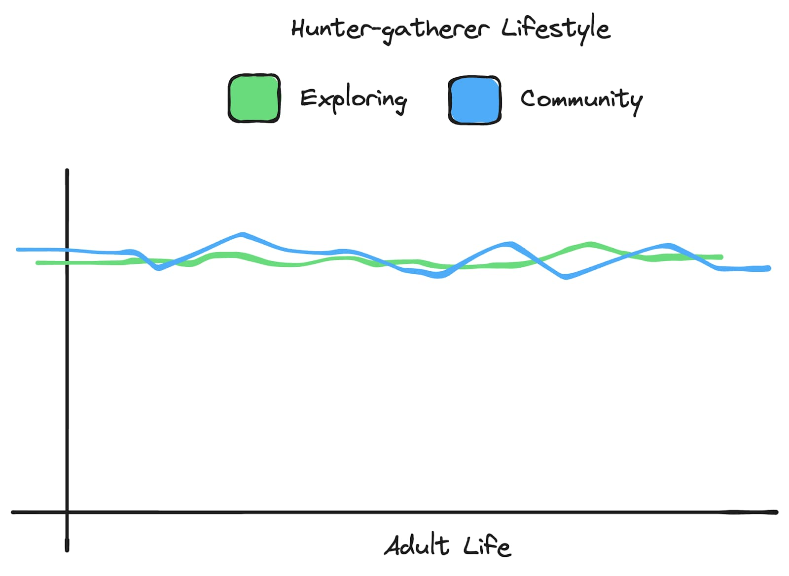
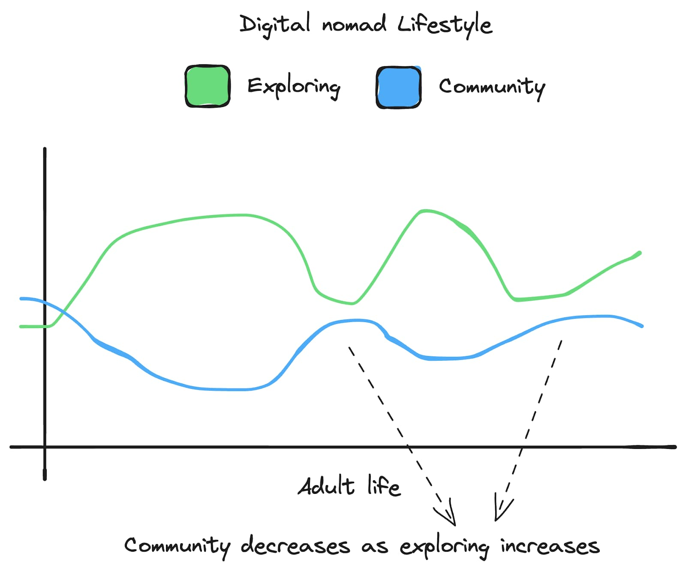
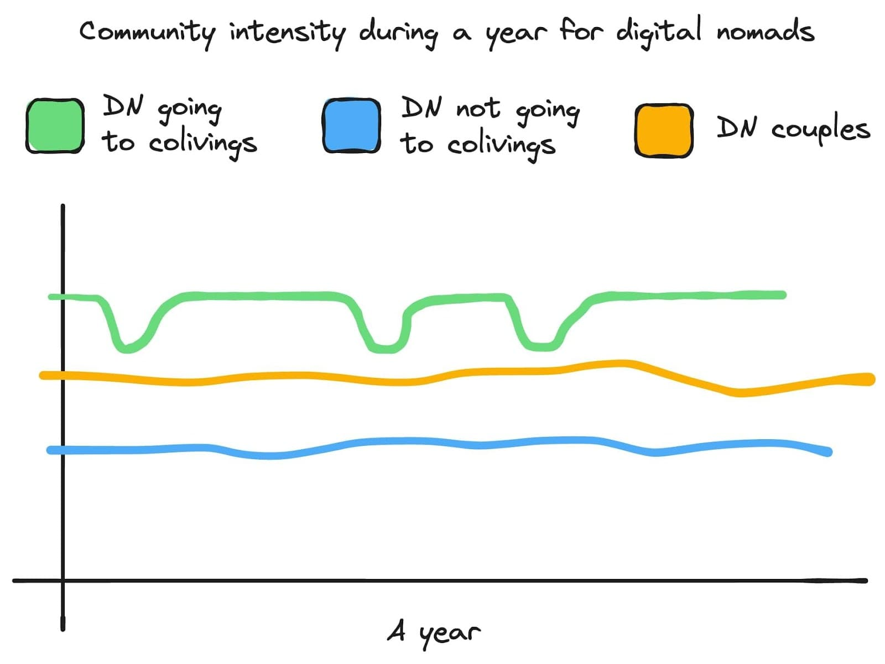
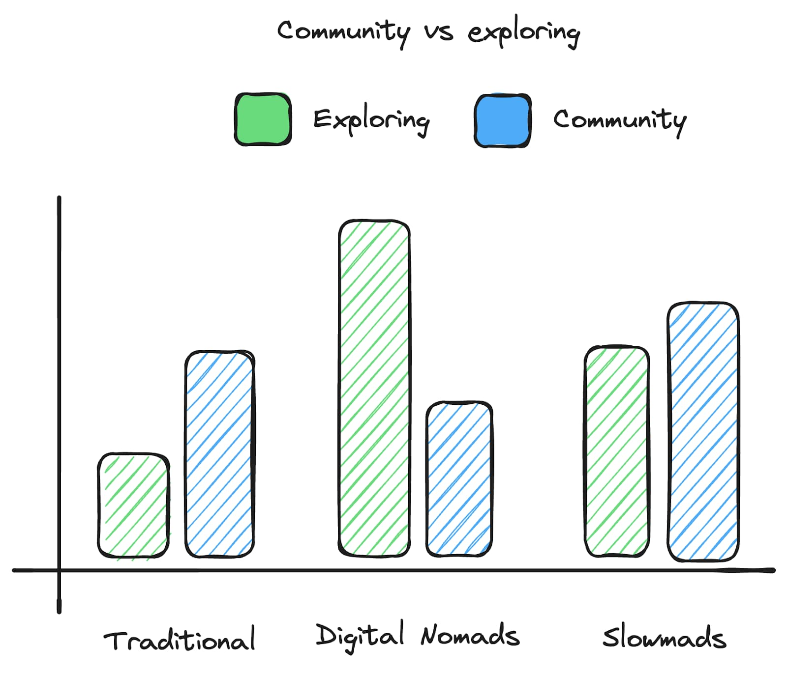

This article discusses why digital nomads eventually opt to settle down, tracing the reasons back to the innate human need for community. It explores how modern lifestyles compare to our ancestors and why the lack of a constant community drives nomads to stop traveling.

I made charts to represent certain data and to make the article more visually appealing. They are based on my own experiences and the experiences of other digital nomads I have met.

## Table of contents

- [Table of contents](#table-of-contents)
- [Our ancestors vs our modern lifestyle](#our-ancestors-vs-our-modern-lifestyle)
  - [The Rise of Digital Nomads](#the-rise-of-digital-nomads)
  - [Colivings for digital nomads and remote workers](#colivings-for-digital-nomads-and-remote-workers)
  - [Nomad couples](#nomad-couples)
- [Why do digital nomads stop this lifestyle?](#why-do-digital-nomads-stop-this-lifestyle)
  - [Bases and Slowmads](#bases-and-slowmads)
  - [Nomad Families](#nomad-families)
  - [Digital nomad problems](#digital-nomad-problems)
- [The future](#the-future)
  - [Hubs](#hubs)
  - [More predictions](#more-predictions)
- [Conclusion](#conclusion)

## Our ancestors vs our modern lifestyle

Ten thousand years ago, Homo sapiens evolved to be a hunter-gatherer. Our ancestors lived in small groups roaming around the world. They did not live as long as we do nowadays, but that life was full of exploration and community.

We are social animals. Our need for interaction with others moves us to form communities. At the same time, we have evolved to be curious and explore. Having those two desires is what has brought Homo sapiens where he is.

Here is a chart representing the life of a hunter-gatherer and their levels of community and exploration along it

Nowadays, exploration and community are separate concepts. Our society has become more individualistic, often placing personal goals ahead of the community. Most people prioritize the community part by putting down roots in a place and making stronger connections through their careers, family, and friends.

This choice limits exploration and mobility. Living in the same place most of your life and creating bonds with the community there leaves the exploration to special occasions, like studying abroad, holiday trips, foreign career opportunities, etc

Looking at our need for community, it is easy to understand why most people have chosen this lifestyle. They stay in the places where they were born or created their first strong bonds because of the community they have built there (family, friends, job).

### The Rise of Digital Nomads

Thanks to the internet and the appearance of remote jobs, people have started to live a different type of lifestyle. Digital nomads, choose lives focused on the exploration desire through travel, remote jobs, independent locations, etc. However, this can come at the cost of community lack, a basic human need.

This does not mean a digital nomad life does not have a community, however, it is harder to make that community constant and relationships last in the long term.

Friendships are formed when exploring new places. However, in common cases, they do not last forever. The digital nomad lifestyle is very volatile and everyone has different plans. Therefore, relationships in place, last only a few months in the best of scenarios. Even nowadays, with [more and more apps and platforms popping up that organize events and trips together](https://www.travelmassive.com/companies), in the long term, sooner or later, nomads end up missing the community part, as we are social beings.

Why do we seek community so much? Easy, the chances of survival and perpetuating the species are much higher living in a community than solo. Our ancestors and natural selection knew this and made us evolve developing positive reinforcements for being among others such as being calm, secure, and happier, and negative ones when we are alone such as loneliness, insecurity, or depression.

### Colivings for digital nomads and remote workers

[Colivings](https://www.mapmelon.com/colivings) also deserve a section in this article. This new kind of accommodation has become more popular since COVID-19 appeared with the rise of remote working.

To provide more context about colivings, I asked ChatGPT to summarize [this article explaining what is a coliving](https://www.mapmelon.com/blog/what-is-coliving-a-guide-for-digital-nomads-and-remote-workers) from [Sole Garcia](https://garciasole.com/). Go check it out if you want to learn more about the term.

“Coliving for digital nomads and remote workers is a community-based living arrangement offering stays from one to three months. It provides not just a place to stay but a vibrant community, combining work-friendly amenities like high-speed internet and coworking spaces with social interaction and local cultural immersion, making it an ideal choice for those seeking flexibility, a sense of community, and an authentic local experience.”

You can also think about it as a “Hostel with Coworking” or “Erasmus for grown-up people” as my friend Mario calls them.

Despite its rising popularity, the percentage of digital nomads going to Colivings is still very low. They are still quite unknown for most digital nomads and remote workers who choose to stay in a hotel, Airbnb, or hostel, and work from their room, a nearby coworking, or a coffee shop.

Colivings play a big role regarding the community, they not only fulfill that need but also our exploration one. Our ancestors explored the world in a community, and digital nomads and remote workers who stay at colivings explore different destinations while making relationships with others and living in a community.

There is a key difference between both communities, the community of our ancestors was a close one. Hunter-gatherer bands consisted of 35-50 individuals. The coliving digital nomad community is very open and the number is rising. You need to put a lot of effort into keeping this community closer by matching your travel plans with your friends’ ones.

The amount of digital nomads and remote workers who go from coliving to coliving or from place to place as a group is very small and traveling together for more than half a year is almost a miracle.

Apps like [mapmelon](https://www.mapmelon.com/) try to lower the effort by allowing you to follow your friends and be updated about their travel plans. However, the effort difference compared to our ancestors' lifestyle is still immense.

This is no surprise, after all, a lot has changed, now it's easier to meet more people and travel to more places. It's no longer common to stay with the same people all your life, however, we evolved to do so and our brain rewards us emotionally when we feel a part of a supportive community that understands our lifestyle and values.

A last note on coliving communities, although the relationships normally last a month or so, they are far more intense than the normal relationships you create if you follow the “traditional” lifestyle. As my friend Tobi put it once:

> “Ironically, I feel that I connect much deeper and much quicker with people when on the road, than with people “back at home”. When you live with someone 24/7 in a coliving space in a foreign country & go on a desert trip with them, this is much deeper than living in separate apartments in the same city and meeting now and then for a regular dinner. Both; the quantity of time & the depth of the experience itself is much more intense”

[I have been living this lifestyle](https://ramonmorcillo.com/lifestyle-as-a-digital-nomad-staying-in-colivings/) for the last few years and can confirm the above.

### Nomad couples

Nomad couples are another group inside the digital nomad community. These individuals do not have the same community needs as solo digital nomads. Therefore, they don’t seek as much to interact with others. They even avoid colivings sometimes because they prefer to have more privacy for themselves or because they are more used to living by themselves and don't want to exit their comfort zone.

Having a couple and traveling with them can boost the sense of community and extend the exploring phase longer than solo nomading.

From my experience and others close to me, staying in a coliving as a couple has more upsides than downsides, but this topic is for a different article.

## Why do digital nomads stop this lifestyle?

Just as the desire for exploration initially drives people to embrace the digital nomad lifestyle, the craving for a stable community often makes them eventually settle down or significantly reduce their nomadic travels.

At some point in a digital nomad life, the need for community gets bigger than the need for exploring. Most of them lose the FOMO of discovering new places and start prioritizing other goals such as having a “home” or base, forming a family, and building stronger relationships and connections. All of these are, at least for now, very hard to achieve while having plenty of exploring. [World schooling](https://travelynnfamily.com/what-is-worldschooling/) is getting more traction nowadays, though and some companies do family traveling.

\
Other digital nomads get exhausted from discovering new places and meeting new people all the time. These factors may come from the isolation and lack of consistent community while continuously moving, as well as the mental load of trying to maintain relationships with the high volume of people encountered. [Humans can only keep up with a limited number of familiar faces](https://www.wikiwand.com/en/Dunbar%27s_number). If settled in one place like your hometown, one might have 100-150 people in their life circle. But while traveling, you meet 20 new people at each destination, and it becomes exhausting to remember them all, message them, keep up with their lives, and try to meet up - a much bigger task than maintaining your 2 best friends' relationships back home.

Humans need social ties and a community - too much independence or being surrounded while feeling lonely wears on the soul.

In the end, nomads decide to plant roots when they crave a closer, consistent community. When they lack a “place to belong”. Remembering experiences of having a solid community base during their childhood, school years, or working a local job pre-nomadism, they assume settling down may be the most effective path to fulfilling their innate need for consistent social bonds and lasting relationships. Of course, as of today, it is easier to build a community if you settle down rather than if you travel while looking for it.

Nomads seeking a stable community frequently end up in areas already serving as hubs for like-minded people and expats. This is happening in places like [Canary islands](https://www.ferryhopper.com/en/blog/featured/digital-nomads-canary-islands), Madeira or [Bansko](https://www.bbc.com/travel/article/20231003-bansko-bulgarias-unlikely-new-digital-nomad-hub). Most friends and familiar faces from previous experiences around the world ended up in these or similar hubs. Take the example of [Nine Coliving'](https://www.mapmelon.com/colivings/nine-coliving)s colivers, a huge group of them end up in Tenerife - which strengthens the fact that residing long-term near familiar faces facilitates deeper bonds and fulfills our long-term community needs.

Other nomads also opt to go back to a place where they already have or have had a community, such as their hometown with their old family and friends.

### Bases and Slowmads

Although settling down will fill the community needs of most, for others the natural demand for exploring won't be filled, especially after living such an exploring-intense life before. Therefore, they will call the place they settle down “base”. Some may even have more than one across the world. They will spend most of their time at this base and from time to time travel and explore again.

Finally, there is another group in the middle, which they call themselves “[slowmads](https://ryanscottbooks.medium.com/slowmads-the-digital-nomads-who-take-their-time-8b9a9ebcb673)”. These are nomads who spend around three to six months at least in the same place. They travel at a slower pace compared to other digital nomads. This way they can fill both needs, exploring and community, better than a digital nomad. This is common with nomad families who move along the school calendar.

Those digital nomads establishing a home base, as well as the slowmads traveling at a slower pace, could be considered part of the Expats community.

Defining clear lines between the three lifestyles above is challenging. Few individuals neatly fall into any single category. The majority adapt their way of living, finding the optimal balance between fulfilling their desires for community and exploration.

A small group of nomads takes an inverted approach - instead of settling in places with preexisting nomad communities, they form roots and then draw that community to their chosen place. Colivings like [Nine](https://www.mapmelon.com/colivings/nine-coliving), [Cloud Citadel](https://www.mapmelon.com/colivings/cloud-citadel), [Anceu](https://www.mapmelon.com/colivings/anceu-coliving), and [Alpiness](https://www.mapmelon.com/colivings/alpiness-coliving) exemplify this approach as they have attracted people to live in areas previously unknown to digital nomads.

### Nomad Families

Another reason nomads decide to settle down is because they want to form a family. They probably don't want to face the challenges of having a baby while living this lifestyle without a close community to help them raise a child.

Nowadays the effort to raise a baby while nomading compared to being in just one place is too high to consider doing so. The stability of the second option is far more appealing. I am always amazed when I meet nomads who achieve to do so, hat off to them.

Raising a family while traveling and exploring is so hard nowadays, which is ironic given that this was the only way our hunter-gatherer ancestors did it for thousands of years.

There is a market in this aspect which is slowly growing and plenty of opportunities to improve family lives. The end goal is for nomads who enjoy this lifestyle and want to raise a kid to be able to do so. Also, give an opportunity to non-nomadic families who want to try this lifestyle.

Here is a list of examples

-   [https://www.boundless.life/](https://www.boundless.life/)
-   [https://www.nomadville.org/](https://www.nomadville.org/)
-   [https://thenomadfamily.org/](https://thenomadfamily.org/)
-   [https://www.worldschoolpopuphub.com/](https://www.worldschoolpopuphub.com/)

### Digital nomad problems

While the digital nomad lifestyle can be amazing, it's not without its challenges that often go undiscussed. These are the main contributors to ending the nomad lifestyle.

The most common ones among them are:

-   Lack of routine. Due to the constant traveling and trying to manage this lifestyle while working remotely. I have faced this more than once during travel-intense months in the past. Adjusting to new environments and working too much while on the move destroyed my routine.
-   Social anxiety. This one manifests in several forms, it can appear because of the exposure to different cultures and traditions, and also when you try to fit in different communities and groups you have just met.
-   Solitude and loneliness feelings when we travel alone and have no one to share our adventure and experiences with.
-   Lack of a place to belong and call “home” as you are constantly traveling and not belonging anywhere.
-   The gentrification originated in the places digital nomads and expats go for the long term. This leads to a rise in the cost of living in the place and problems with local people. [Lisbon, Bali and Tenerife are a few examples of places happening](https://www.euronews.com/travel/2023/05/12/proto-gentrifies-are-digital-nomads-ruining-portugal).

If we could recreate the strong community bonds of our ancestors while embracing modern traveling, many of these issues could be avoided altogether.

## The future

We are still at the beginning of the digital nomad and remote working era. I believe these tendencies will keep going up and up.

At the same time, an ecosystem of places, accommodations, and software will appear to support them with a strong focus on the community. City hubs, colivings, nomad apps, and others will be invented in the upcoming years.

They will probably struggle with new regulatory hurdles or resistance from local communities suffering from gentrification.

This thriving ecosystem will enable nomads to sustain their traveling and exploring phase for longer periods before embracing a slower pace or establishing a home base. However, in the end, most nomads will end up slowing the pace and settling down as the community and stability aspect will surpass the exploring one.

I hope at some point some of us will reach an equilibrium between both, and we can have a life similar to our ancestors' with community and exploration on an equal level.

For example, nomads having semi-permanent bases in two or three locations that work for their lifestyle with other like-minded individuals. They could spend around four months in each place, allowing enough time to create deep local connections and dive in the culture and community, while still satisfying their need for exploring by moving between these familiar bases annually.

Or a group of nomads spending six months living and working together in a coliving space, while immersing themselves in the local community. After that period, they move as a unit to a new destination, keeping their strong bonds while experiencing a new setting to explore.

This constant cycle of prolonged community living balanced with periodic relocations could provide the best of both worlds.

### Hubs

The number of digital nomad hubs will increase for sure. Touristy locations, preferably the lesser-known will be the most favorable to host this growth. Also the ones in warm areas with an affordable life level.

Examples of nowadays hubs that are growing are the Canary Islands in Spain, Bansko in Bulgaria, Madeira and Lisbon in Portugal, Bali in Indonesia, Chiang Mai and Koh Lanta in Thailand, [Hoi an - Da nang area in Vietnam](https://digitalnomads.world/city-guide/hoi-an/), and much more.

These hubs appear not only for the weather or the cost of life but also for strategic reasons. For example, Bansko in Bulgaria has grown a lot in the past years because of its location. It is both, next to Europe and outside the Schengen zone at the same time. Thanks to this, non-European nomads can jump in and out of the Schengen zone easily.

However, in [2024 Bulgaria and Romania are entering the Schengen zone](https://ec.europa.eu/commission/presscorner/detail/en/ip_24_1722). I expect the Bansko situation to change a little. Places in neighboring countries like Turkey, already popular with nomads, will likely become more popular as hubs in the coming years. [Antalya is a good example of this](https://digitalnomads.world/tips/why-antalya-turkey-is-the-next-digital-nomad-hotspot/).

Another example is the island of [Madeira, Portugal](https://www.portugalresidencyadvisors.com/digital-nomads-madeira-the-ultimate-paradise/#:~:text=Portugal%20Digital%20Nomad%20Visa%20Madeira,while%20working%20remotely%20from%20Portugal.) where its low tax rates and digital nomad visa made a lot of nomads to end up there looking to minimize their tax burdens while living in a subtropical paradise.

### More predictions

It will become easier to settle down in new countries, find a community and the resources to raise a family. Particularly in the hubs, where they will also develop facilities and programs around nomad families.

More countries will offer digital nomad visas, and more global remote working programs and [health insurance](https://safetywing.com/?referenceID=25131433&utm_source=25131433&utm_medium=Ambassador) will cover several countries. It will all depend on if it is worth it for each country's economy.

Colivings for remote workers and digital nomads will continue popping up, and more hospitality businesses will embrace this lifestyle, hostels, and guest houses mainly. They will offer amenities focused on remote working and community, such as coworking or shared meals. Plenty of them will rebrand themselves partially or entirely as colivings. And some will keep operating in both ways depending on the season, as hostels are more profitable in high seasons than colivings. [Sun and co in Jávea](https://www.mapmelon.com/colivings/sun-and-co), Spain is already doing this.

As nomad popular spots proliferate globally, [the FOMO](https://starchild.hashnode.dev/digital-nomad-fomo) on trendy destinations will decrease. Instead of rushing to check boxes by visiting overcrowded cities, nomads will selectively explore lesser-known gems at a more sustainable pace.

Therefore, people will go to places based on their community, their lifestyle or to achieve a desired lifestyle. For example, if someone is interested in entrepreneurship or local impact, instead of going to Lisbon because is popular, they will go to rural colivings focused on those interests. Or people will go to hubs in countries which have tax benefits for their work situation.

On the negative side, gentrification will rise, mainly in the hubs already popular for tourists before nomads and expats go there. Sadly, more movements against digital nomads will arise too, and laws to regulate this lifestyle. Colivings focused on community and local impact will help against these as most of them will be located in rural areas and collaborate with the local community, having a positive impact in the area. The best example of this is what [Anceu Coliving is already doing in Galicia, Spain.](https://anceu.com/local-impact-from-a-rural-coliving-space/) Thanks to their actions, locals are now happy to welcome remote workers and digital nomads from outside.

[Population in developed countries of Europe countries is getting older](https://www.imf.org/en/Publications/fandd/issues/Series/Analytical-Series/aging-is-the-real-population-bomb-bloom-zucker) (Also in other places such as Japan), therefore towns and rural areas are becoming less and less populated. Colivings and digital nomads can and hopefully will help to mitigate this problem. Actually, some governments are promoting and offering benefits to people who buy properties or want to live in areas where locals are old people and their towns are being abandoned. For example,[Japan with the Akiyas](https://jobsinjapan.com/living-in-japan-guide/akiya-the-phenomenon-of-abandoned-homes-in-japan/), or [Italy with their one euro houses](https://1eurohouses.com/). I do expect and hope to see the number of these programs rising.

## Conclusion

Overall, the digital nomad and remote working movement will keep growing and I [encourage everyone to try this lifestyle](https://ramonmorcillo.com/lifestyle-as-a-digital-nomad-staying-in-colivings/). However, on an individual level, nomads may finish this lifestyle due to the challenges of combining exploring with strong community bonds.

Our evolutionary social community urge plays a big role in our lives.

Being part of temporal nomadic communities or alternating between settling and roaming can help balance these human necessities.

In the end, the pull of social stability through putting down roots or slowing the pace is stronger.

Community frequently wins over endless exploration when we focus on the sustainability of nomadism over a lifetime.

Keep in mind the majority above is focused on the most digital nomads and friends I have met. There are exceptions to the rules above, I’ve also crossed paths with nomads who’ve happily been exploring for ten years or more.

I hope this article helps new and old digital nomads to be aware of what to expect from this lifestyle and live it fully.
