The Canary Islands are a Spanish archipelago located in the Atlantic Ocean, west of Morocco. Here I will share the knowledge and experiences from my time living there for anyone planning to visit the Islands. This guide will provide a general view of them and then focus on the ones I visited.

Here is the map from my [World Places project](https://ramonmorcillo.com/map) where I added my favorite places from them and others that people suggested to me. To use it, have a look at the legend and select the layers you are interested in.

<iframe height="350" width="640" src="https://www.google.com/maps/d/u/0/embed?mid=1O0IseePWpXqpT0v6srZyZMRDAvHhpWDg&amp;ll=28.362176239479567%2C-16.220206526556023&amp;z=7"></iframe>

Although I did not visit every island, a good reason to go back in the future, I can confirm a well-known fact about them: _they are all very different._ Each one has different landscapes, cultures, and gastronomy.

This fact is perfect because no matter what your travel style is, you will find one that suits your needs.

Most of the pictures and data from this guide come from my time living there. Other external resources properly credited have been used.

This guide will focus first on the general aspects of all the islands and then on the specific characteristics of each of them.

## Table of Contents

- [Nature](#Nature)
- [History](#History)
- [Gastronomy](#Gastronomy)
  - [Papas arrugadas](#Papas-arrugadas)
  - [Mojos](#Mojos)
  - [Goat food](#Goat-food)
  - [Gofio](#Gofio)
  - [Desserts](#Desserts)
  - [Venezuelan food](#Venezuelan-food)
  - [Fish and Seafood](#Fish-and-Seafood)
  - [Others](#Others)
- [Islands](#Islands)
- [Tenerife](#Tenerife)
  - [Gastronomy](#Gastronomy-1)
  - [Cities and towns](#Cities-and-towns)
  - [Nature](#Nature-1)
- [Gran Canaria](#Gran-Canaria)
  - [Gastronomy](#Gastronomy-2)
  - [Cities and towns](#Cities-and-towns-1)
  - [Nature](#Nature-2)
- [La Palma](#La-palma)
  - [Gastronomy](#Gastronomy-3)
  - [Cities and towns](#Cities-and-towns-2)
  - [Nature](#Nature-3)
- [Fuerteventura](#Fuerteventura)
  - [Gastronomy](#Gastronomy-4)
  - [Cities and towns](#Cities-and-towns-3)
  - [Nature](#Nature-4)
- [La Gomera](#La-Gomera)
- [El Hierro](#El-Hierro)
- [Lanzarote](#Lanzarote)
- [La Graciosa](#La-Graciosa)
- [Acknowledgments](#Acknowledgments)

## Nature

Being an Atlantic archipelago of volcanic origin, the nature of the Canary Islands offers original landscapes. A subtropical climate is found among them that varies depending on the altitude.

There is great biological diversity from humid forests to arid deserts and high mountain areas.

Sometimes _Calima_ situations occur. Calima (haze) is the local term used to describe the presence of suspended dust that comes from the African continent (mainly from the Sahara and Sahel deserts).

](./assets/santa_cruz_de_tenerife_covered_by_the_haze.jpg)

The flora is very different compared to the mainland one. From all the new variety of plants you can find here, there is one that stands out and only lives here: The **Canary Islands dragon tree** or **Drago**.

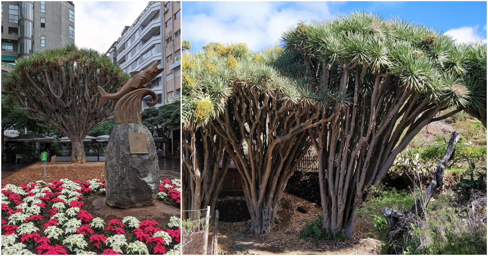

There is another tree that can be found in other parts of the world, however, the variety of the Canary Islands is unique. The **Canary Pine** is the most abundant tree in the Canary Archipelago from where it is endemic. It can reach heights greater than 60 m and the most shocking: Is resistant to fire! This is due to the thickness of the bark which is why it survives moderate fires.

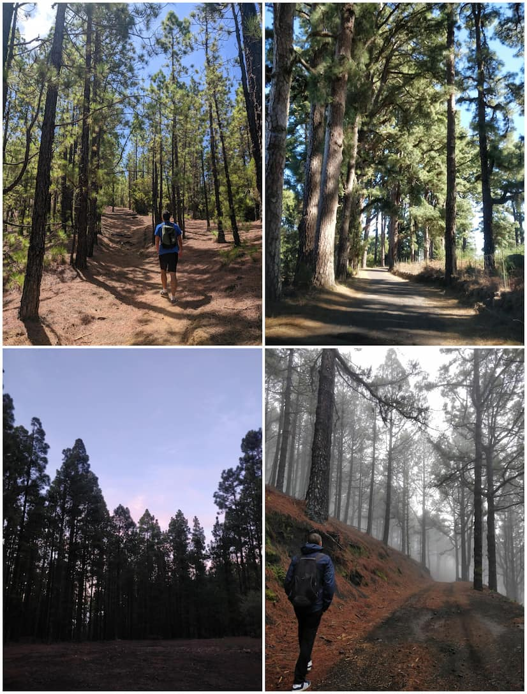

The Canary Islands are known around the globe to be [a perfect stargazing spot.](https://ramonmorcillo.com/basic-tips-for-amateur-star-photography/) The quality and low light pollution of its skies are such that they have multiple Observatories. La Palma and Tenerife have two international astronomical observatories of the International Astronomical Center dedicated to the _study of how the universe in which we live works._

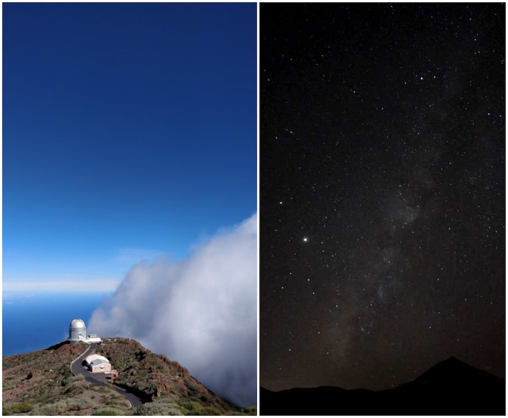

## History

The first Indigenous peoples of the Canary Islands were the **Guanches**. They supposedly arrived from North African and are related to the _Berbers._ However, I heard other theories that relate them to other ancient civilizations like the Vikings, Phoenicians, or Romans.

In the 14th century, Europe began to rediscover the islands. And in the **15th the Conquest of the Canary Islands by Spain** started with Lanzarote and Fuerteventura and ended with Tenerife in 1495. **In 1492 Columbus' fleet sailed from La Gomera, towards the New World.**

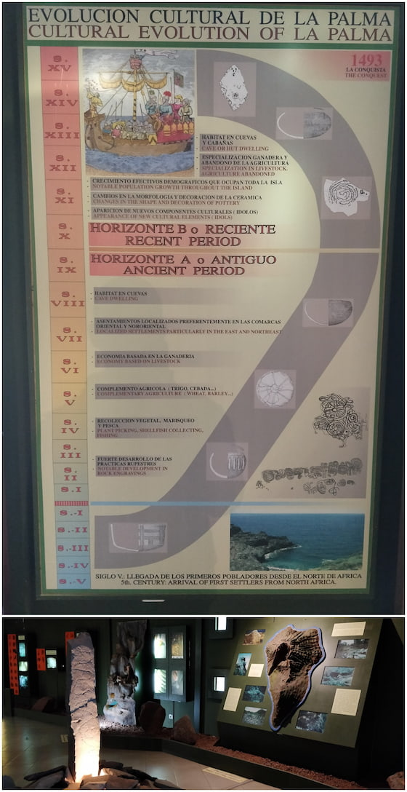

**Until the 18th century,** Immigrants from Europe came to the Canary Islands, and from the Canary Islands, emigrants also left America.

Other nations tried to seize the Canary Islands from Spain. The most famous that could have changed the fate of the archipelago occurred in 1797. The British Vice-Admiral Nelson along with 4000 soldiers were defeated trying to conquer Santa Cruz de Tenerife defended by barely 500 Spaniards, a French detachment, and local militias.

**In the 20th century,** the Spanish civil war, postwar, and the dictatorship of General Franco brought times of misery and emigration, mainly to Venezuela.

Since the 1960s, **mass tourism** has burst into the islands as a new economic alternative, which lasts until today. 

After the approval of the Spanish Constitution in 1982, the process of formation of the State of the Autonomies began. **Nowadays the Canary Islands is one of Spain’s 19 autonomous communities.**

Its **flag** colors represent the two provinces separated by the sea. The white color of the _Province of Santa Cruz de Tenerife_ and the yellow color of the _Province of Las Palmas._

## Gastronomy

Every island has its own distinctive food. However, there are meals that you will be able to find in all of them. Seafood is very common, the sea is close after all.

### Papas arrugadas

Probably the most well-known meal from the islands. They are small baked potatoes that are frequently accompanied by _mojos_. They are called **arrugadas** which means they have wrinkles on the skin.

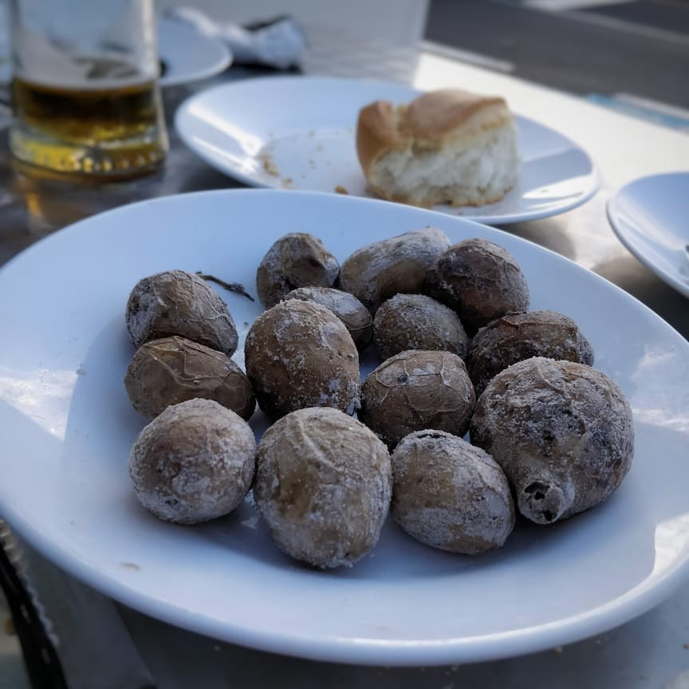

### Mojos

The main sauces from the Canary Islands. The _red mojo_ and the _green mojo_. The red is also known as "mojo picón". Although the red one is the best known outside the archipelago, both are equally important among the islands.

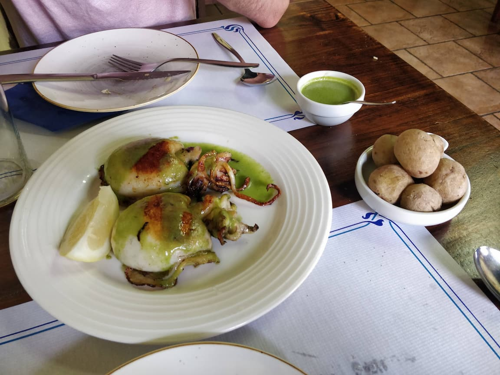

The red one is normally spicier and is made with peppers. It is commonly served with meats while the green one is used for fish and is made with green pepper, parsley, and garlic.

### Goat food

Goats are the dominant farm animal on the islands therefore a lot of meals are made with resources coming from them. The smoked cheese with mojos and or palm honey was my favorite starter there.

### Gofio

If there is a distinctive food from the Canary islands it has to be the Gofio.

> Gofio is a sort of Canarian flour made from roasted grains (typically wheat or certain varieties of maize) or other starchy plants - [Wikipedia](https://en.wikipedia.org/wiki/Gofio)

Canary people use it in plenty of dishes: soups, stews, desserts, etc. If you are in La Palma,  it is worth visiting the Gofio Interpretation Museum (MIGO)  to learn in-depth about this food.

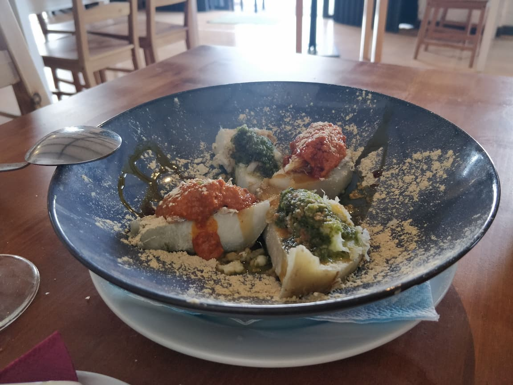

### Desserts

To end the meal there is nothing better than a “Quesillo” or “Polvito Uruguayo”. The first one is a mix between cheesecake and flan. 

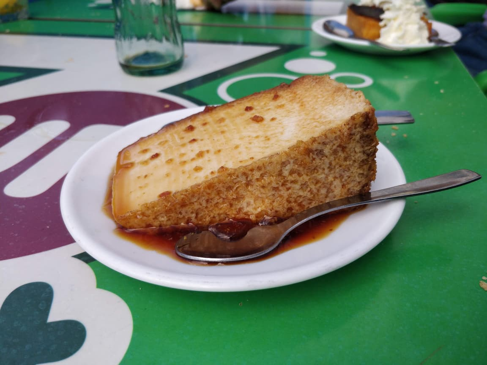

The Polvito Uruguayo on the other hand is made of cream, caramel, and cookies.

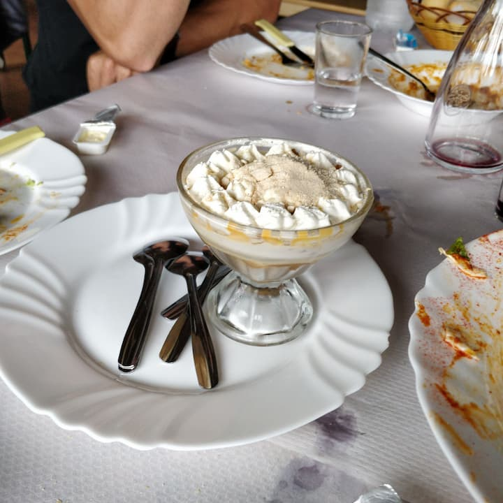

### Venezuelan food

The Canary Islands have historically been influenced by Venezuela and a great part of its population comes from there. Therefore, plenty of its cuisine and restaurants are Venezuelan. Be careful because it’s easy to fall in love with their “Tequeños” and “Cachapas”.

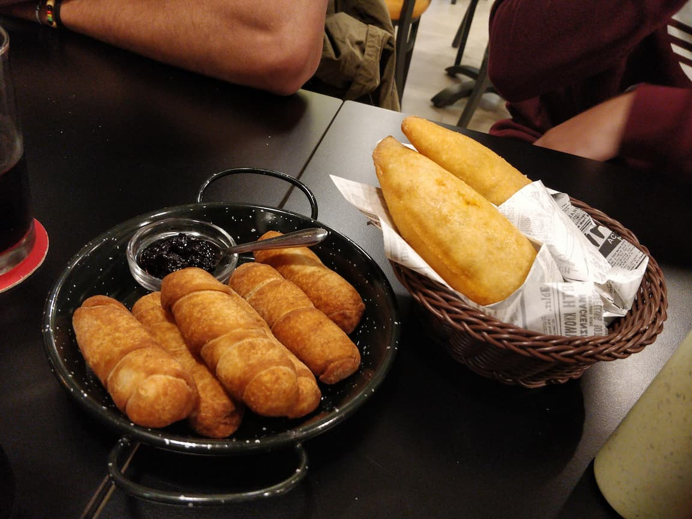

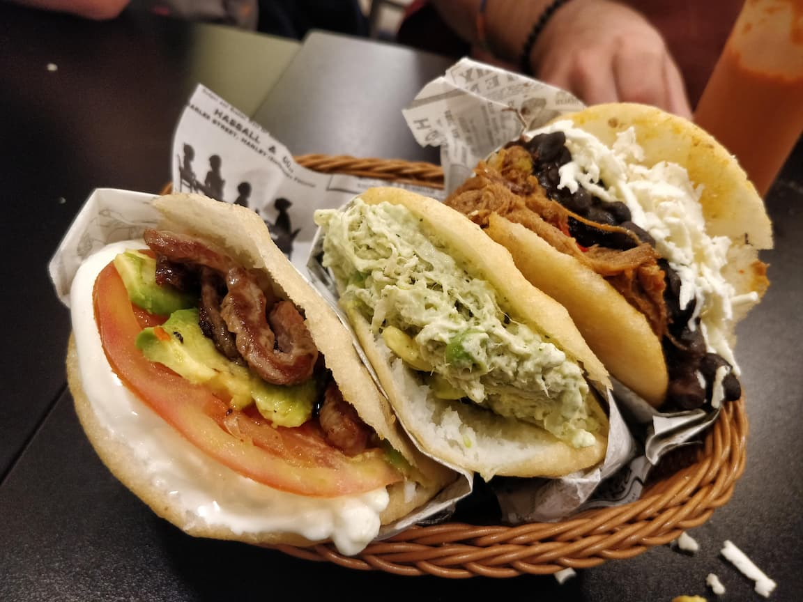

### Fish and Seafood

Fish and seafood are also quite common and of good quality.

### Others

Here are common food products among the Canary Islands very rare around other world places. The most distinctive are the crisps **Munchitos,** the soda **Clipper,** and the candy bars **Ambrosias.**

## Islands

There are eight islands on the archipelago and all of them are unique. I have not visited El Hierro, La Gomera and La Graciosa, _yet._ Therefore I will focus more on the other ones I was able to travel to.

](./assets/map_of_the_canary_islands_from_wikipedia.jpg)

## Tenerife

The greatest of them. This island offers plenty of things to do from beaches, museums, hiking, or visiting local towns. If you are looking for a place to stay when visiting it remember the north of the island has more local life, and the south is more oriented to mass tourism. Therefore, if you want to have a better experience I would suggest you stay on the island’s north side.

### Gastronomy

Tenerife is well-known for its **Guachinches.** They are an establishment where locally produced wine is served accompanied by homemade traditional food. They are originally from the _Orotava Valley._

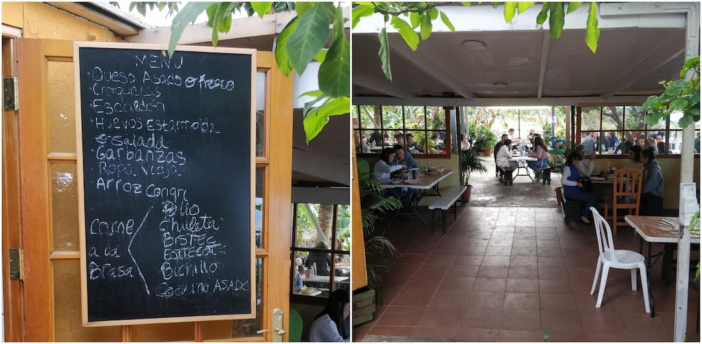

The most typical dishes you should try from these places are the “Ropa vieja”, “Carne de fiesta”, the Gofio-made “Escaldón” and grilled meat. 

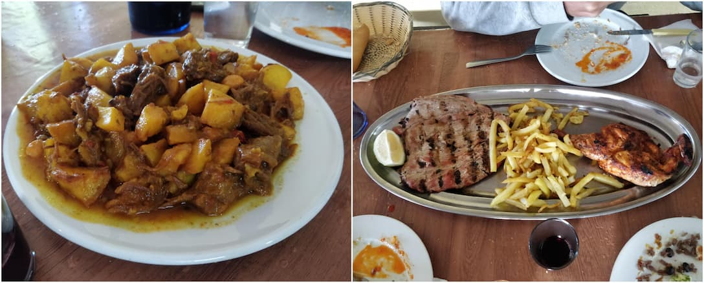

Most of them will also have delicious homemade Spanish croquetas.

Speaking about croquetas, an honorable mention has to be made to the amazing _banana croquetas_ I ate in Garachico at _Tasca Restaurante Los Pinos._

If you are into **beer** _Dorada_ is the main from Tenerife. Their logo is obviously The Teide. They have a wide variety to choose from.

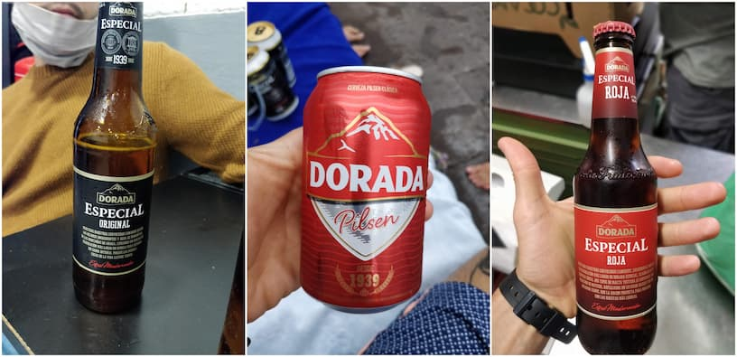

And for **coffee** lovers, you can’t leave this island without trying the _Barraquito_ or _Zaperoco._ A multi-layered coffee liqueur drink. Each layer references Coffee, Licor 43, milk, and accompanied by cinnamon and or/lemon peel.

### Cities and towns

I will not focus on the most touristic places like Las Américas, Los Cristianos, Puerto de la Cruz, or the Capital of Santa Cruz but on the hidden gems. The local towns worth a visit to see the authentic Tenerife.

**La Laguna or San Cristobal de La Laguna.** Not a town but a city next to the capital Santa Cruz. University city which downtown has been classed as a World Heritage Place. It has its own colder microclimate compared to other parts of the island. Remember to bring a jacket just in case.

**La Orotava.** A town with plenty of traditional colorful Canarian architecture. You will find traditional Canarias houses with balconies and courtyards. The _Casa de Los Balcones_ is a must-visit to get to know the traditional houses and how people lived there in the past.

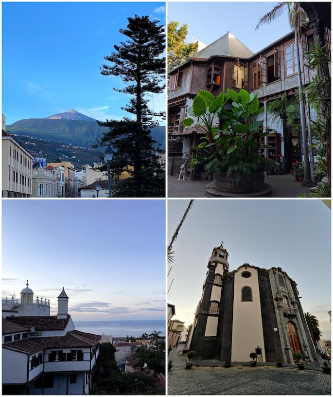

**Icod de Los Vinos.** A large town in the north of the island home to _the oldest Dragon Tree in the world,_ which is believed to be over 800 years old. In addition, it has an amazing butterfly zoo that you should visit whether you like butterflies or not.

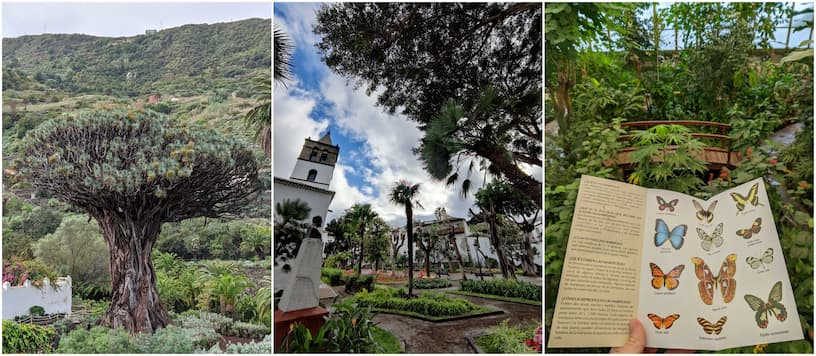

**Garachico.** A picturesque coastal town once the most important port on the island until a volcanic eruption buried half the city in 1706.

**Candelaria.** Located on the east coast, south of Santa Cruz. Next to its Basilica, there is a set of nine bronze statues, representing the nine Guanches. The Tenerife tribal leaders at the time of the Spanish conquest.

**Masca.** The "hidden” town from the northwest of the island in the middle of the **Teno Rural Park.**

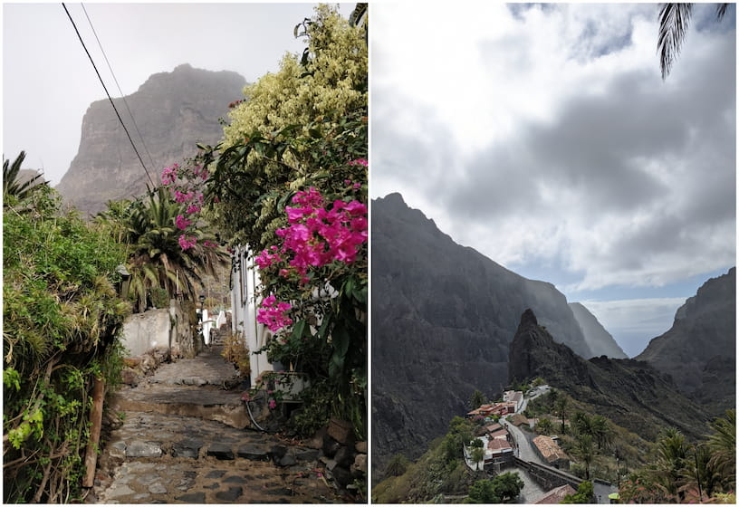

### Nature

Tenerife is probably the one with the most nature diversity. Different local weather conditions and micro-climates around the island are provided by its unique climate and geography. All these different factors contribute to the presence of multiple types of plants and animals. As well as areas of forests, beaches, deserts, and mountains.

**Teide National Park.** Named after [Mount Teide, the highest peak and volcano in Spain.](https://ramonmorcillo.com/how-to-enjoy-the-sunrise-from-the-top-of-spain/) There are trails that lead to the summit or you can take the cable-car. Other points of interest are the _Pico Viejo_ and the rock formations of _Roques de García._

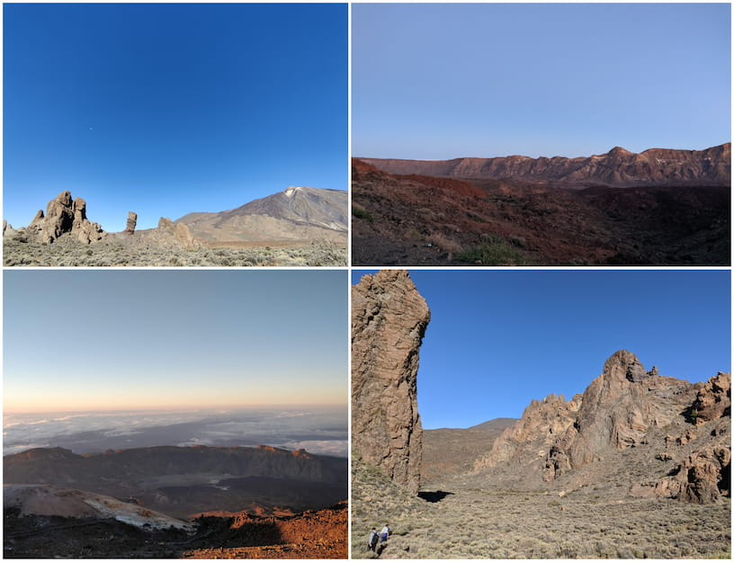

**Rural Anaga Park.** Located in the north of the Island it was declared _Biosphere Reserve._ It is the place with the highest amount of endemism in Europe. It houses from humid dense forests to dream beaches along the Benijo coast.

**Teno Rural Park.** Located on the north-west part of the island. The altitudes go from sea level to high peaks. The vegetation of this area varies according to how high you are.

**The Orotava Valley.** Although it is not strictly speaking a valley, is the name given to the north-west lower slopes of the Teide. Named after La Orotava.  _La Caldera_ is one of the best nature spots for hiking here.

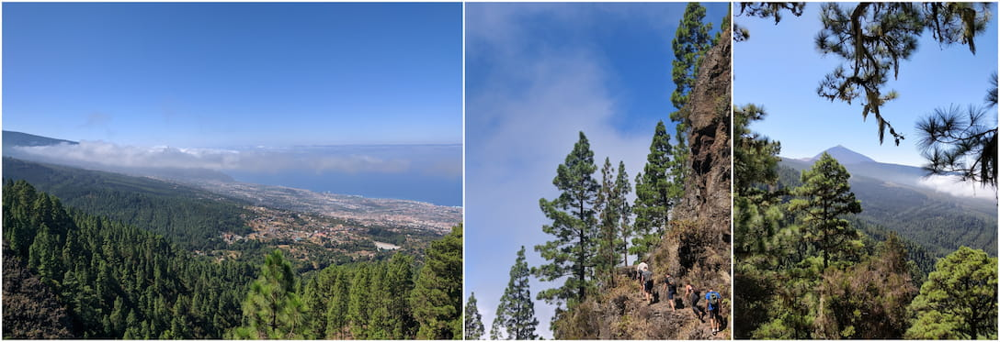

**Charcos.** Around the coast of the island, you can find these beautiful volcanic rock swimming pools.

## Gran Canaria

Home of the Canary Islands capital, Las Palmas de Gran Canaria. As happened in Tenerife, the south of the island is more oriented to tourists while the locals reside in the center and north. It was named this way because of the abundance of large dogs (_can_ in Latin) existing in it.

###  Gastronomy

**Chorizo de Teror.** Original from the Teror locality. This red sausage is similar to the _sobrasada,_ and can be eaten alone or, given its softy, spread on bread.

](./assets/chorizo_de_teror.jpg)

**Carne de Cabra.** Goat's meat. This meal is more common in the interior regions of the island such as Tejeda.

**Gofio escaldado.** Very similar to the _escaldón_ from Tenerife. A gofio-made plate accompanied by onions.

**Truchas.** These sweet dumplings are sweets made with sweet potatoes, sugar, and cinnamon. Are found along all the island.

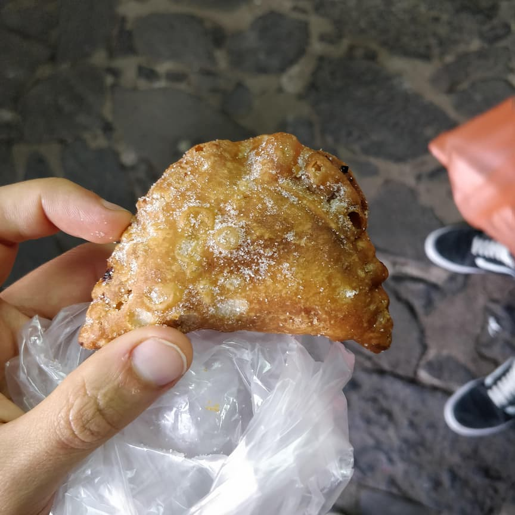

When it comes to drinks, and more specifically **beers,** the classic one from Gran Canaria is the **Tropical.** Known for having the logo of a dog that turns blue when the beer is cold. A nifty way to help people know when it's ready to drink. Mention that **sparkling water** is much more common on this island than on others.

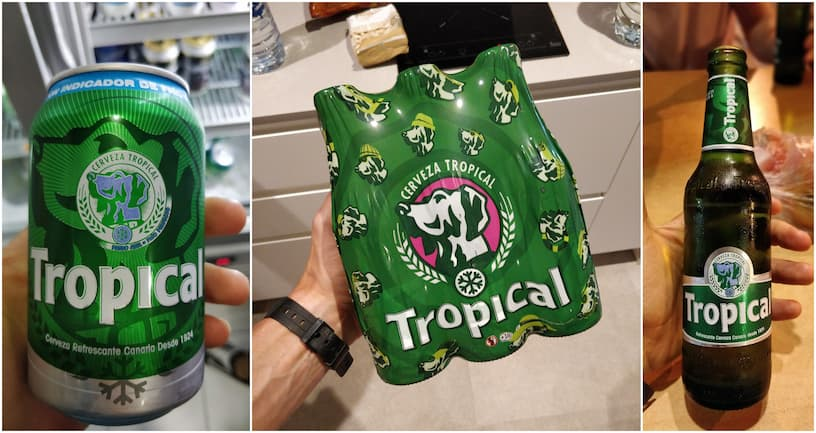

###  Cities and towns

The mass tourism cities in the south are so artificial that you feel like being in a theme park. To The most important ones are _Maspalomas,_ _Playa del Inglés,_ or _Puerto de Mogán._

I will list here the towns and places worth visiting if you want to see the beautiful architecture and local life of Gran Canaria.

**Vegueta.** The founding neighborhood of Las Palmas de Gran Canaria. If you visit or stay at the capital make sure to take a walk around its streets to go back to a different era in the past.

**Tejeda** and **Cruz de Tejeda.** Located in the center, Tejeda is famous for being credited as one of the most beautiful towns in Spain. The second one is a charming waypoint to make an stop or begin a hike from.

**Telde.** The second most populous municipality on the island. The oldest city and the first capital of the island. This can be appreciated when you walk through of its neighborhoods

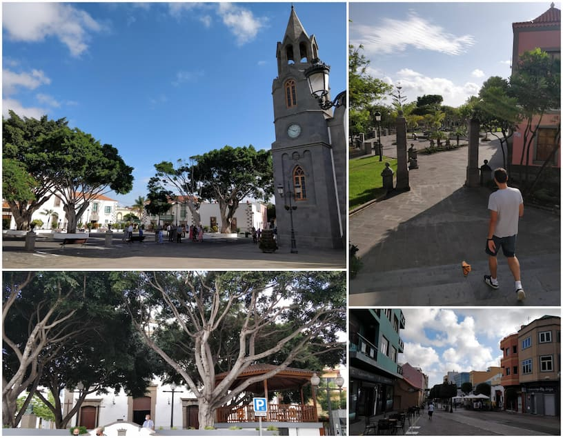

**Teror.** A lovely town whith streets full of houses with beautiful balconies. Mainly known for two things, its **chorizo** and the enormous **pine** from the main square. The latter gives name to the _Virgen del Pino_ (Virgin of the pine), patron of Gran Canaria.

**Agaete.** A coastal town located in the northwest. Its beautiful seaport “Puerto de las Nieves” is where the daily ferry with the island of Tenerife heads from. A rock formation known as the _Finger of God_ that looks like a human finger rises up off the coast.

### Nature

The second largest island in the archipelago is more than a beach island. The interior of Gran Canaria has plenty of mountains and astonishing areas to explore.

**Roque Nublo.** The third highest place in Gran Canaria. Located in the geographic center of the island, near Tejeda. When declared a Natural Area and Rural Park it got converted into a Canarian symbol. The desert landscape that surrounds this giant stone seems from another planet.

**Maspalomas Dunes.** South from the mass tourism city _Playa del Inglés._ A sea of sand considered a small desert. Its appearance changes according to the wind hence every day the dune landscape gives you a different picture.

**Pico de las nieves.** Not far from Roque Nublo. It is the highest peak of the island (1,949 meters.). A spot to visit for the views and the surrounding routes.
 

**Tamadaba Natural Park.** Located in the west of the island this mountain range is undoubtedly one of the most beautiful parts of Gran Canaria and probably my favorite one. From **Agaete** until the **Mirador del Balcon** you will find natural wild beaches, view spots, and hidden lagoons like the **Charco Azul.**

## La Palma

Known as “La Isla Bonita” (the beautiful island). It Is the greenest one full of lush forests. A perfect destination for hiking and [stargazing](https://ramonmorcillo.com/basic-tips-for-amateur-star-photography/). You can find international observatories in the _Roque de Los Muchachos,_ the second highest canary peak after the Teide. UNESCO declared the whole island of La Palma a World Biosphere Reserve.

### Gastronomy

**Chicharrones.** La Palma typical tapa made of square pieces from the pork belly bathed in gofio.

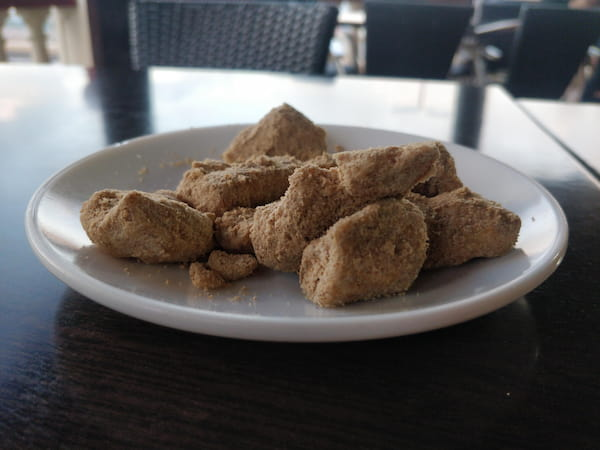

**Bananas.** La Palma is the island producing the most bananas after Tenerife. Therefore, they are quite common as well as products based on them.

You can find plenty of **Venezuelan** and **German** gastronomic options given the high population percentage from those countries. On this island, I discovered the **Cachapas** and it was _love at first bite._

The **Tea Wine** made on this island is a unique variety not found anywhere else in the world. It is elaborated in canary pine barrels therefore the liquid mixes subtly with the pine sap. They have two local** **brands of **craft beer** called _Isla Verde_ and _Gara_

### Cities and towns

**Santa Cruz de la Palma.** The capital of the island whose traditions are based on the sea. Its downtown was classified as a Historic-Artistic Complex since it preserves buildings from the 16th and 17th centuries. An example is the unique set of wooden balconies that overlook the sea.

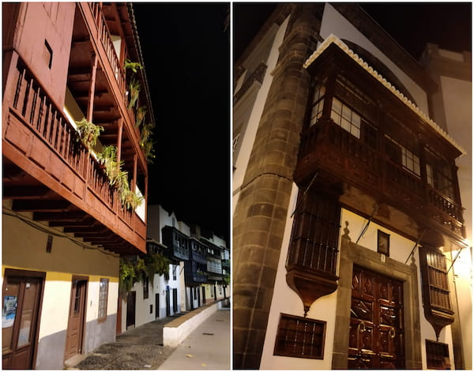

**Los Llanos de Aridane.** The second most populous municipality. The best area is the old town part. On Sundays, the most important flea market on the island takes place in a nearby open area.

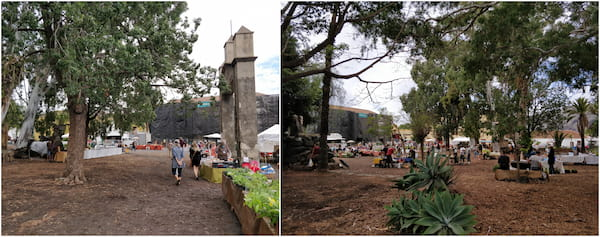

**Port of Tazacorte.** A small coaster town. Worth visiting it and walking around the dock and beach or having a snack.

**Tijarafe.** A tiny local town located on the heights with views of the west coast of the island. A street called poetically _Adios_ (Goodbye) used to lead to the cemetery. Now there is a text fragment on one of its walls.

> “If you come to visit my island, La Palma, do not forget Tijarafe where there is a street called Adios… (…) What kind of secret did it cherish that its memory has endured across a distance, measured by waves, from almost a lifetime ago? We knew it later on. It was neither a shadow of love nor of mystery, it was not an aroma of legend (…) “Adiós” (Goodbye) simply, was the street which led to the cemetery. But I am going to say that it was in an exquisite manner: it was with poetry, something which scarcely exists in municipalities, or rather in any subject matter.
I do not think that it was named by councilors: it was the village, a tiny village, which got used to calling it that, or it was born with its name, which was private, innate, exact. Hence the grace, the delicacy which could not be forgotten by those who looked at it when they were children.
The street goes down a slope, cut on a rock; the village is located above it, with a handful of houses on the verge of the ravine. But going down, and on the slope which descends vertically, on a fold of the rock, the cemetery, put there as if it were a bunch of lemon blossoms on the mountain’s chest.
It is well understood that it is difficult to reach that place, even for the children of this rugged countryside, experienced in crossing over ravines. This was the origin of the custom of stopping at the opening where the street was broken up by a series of gullies running downhill.
This used to be the threshold of the farewells: companions would remain there for a while, watching a small group of people go down. There, in a touched silence, the friend gave the leaving friend the last greeting, brothers to brothers…Afterwards, they went up the street in silence and the street, impregnated with sighs, rich in goodbyes without exit, could have just one name: and it was called Adios (Goodbye)”.
Extract from the book of Dulce María Loynaz, “Un verano en Tenerife”, Aguilar, Madrid, 1958

A little further south from Tijarafe you find the viewpoint of **El Time.** A must stop to enjoy the views.

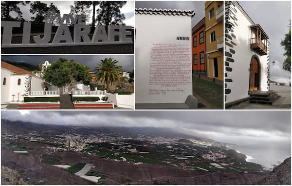

**Garafía.** Not a town but a municipality. Worth mentioning for having points of great cultural importance.

- **Museo de Interpretación del Gofio (MIGO).** The best place to learn about the history of the most fundamental Canarian food and understand all its secrets. It even preserves one of the iconic windmills for milling the grains.

- **Buracas Caves.** Near the Gofio Museum MIGO. A nature area full of Dragon Trees and samples of the island’s rural architecture.

- **Cultural Park La Zarza.** The home to the original inhabitants of La Palma, the _Benahores._ There is a museum about the history of the island throughout the centuries. Moreover. On the outside, a pleasant trail goes along a forest where they lived in caves and painted circular markings on rock walls.

### Nature

**Roque de los muchachos.** At 2426 meters it is the highest peak on the island. One of the most emblematic natural monuments on the island of La Palma. International observatories populate the summit [gazing at the stars.](https://ramonmorcillo.com/basic-tips-for-amateur-star-photography/)

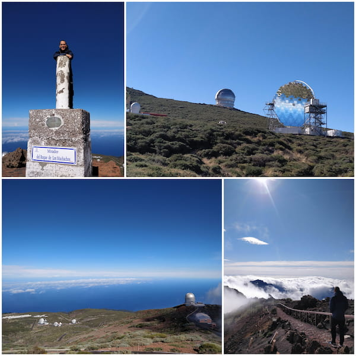

**Los Tilos.** In the northeast part of the island, this natural park of jungles and forests is a perfect spot for hiking.

**Caldera de Taburiente National Park.** Declared World Biosphere Reserve by Unesco. The impressive landscapes are the product of large-scale landslides through multiple volcanic eruptions that have occurred over the centuries. The viewpoint of “Los Andenes” is a nice one to contemplate it.

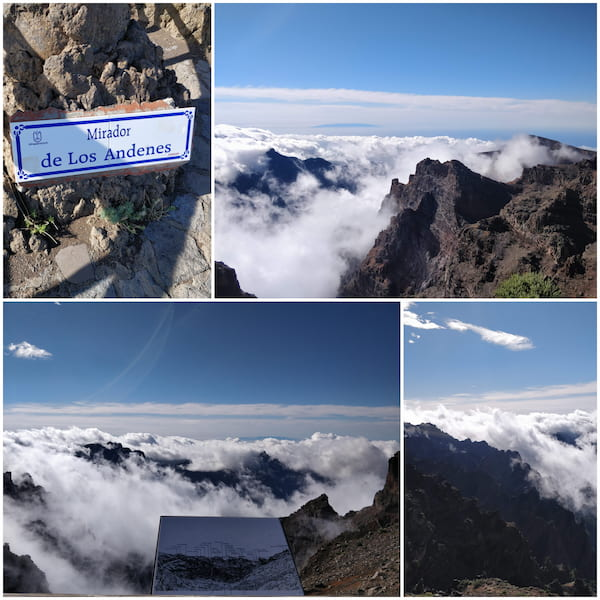

**Cueva de Las Palomas.** In 1949 a volcanic eruption buried part of the area and formed a [lava tube.](https://en.wikipedia.org/wiki/Lava_tube) The landscape and views are worth visiting. You can book tours inside the lava tube in the visitors center.

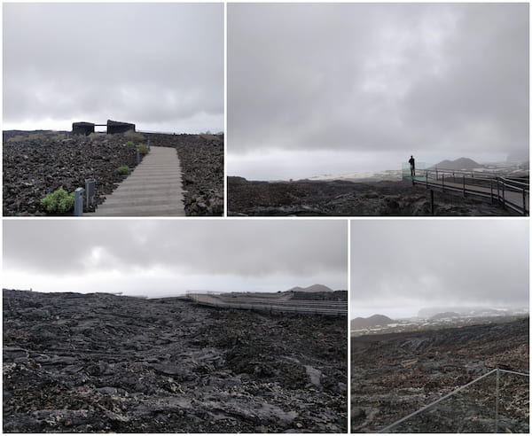

**Cumbre Vieja National Park**. Another great spot for hiking that covers the entire south-central part of the island.

**Echentive beach.** Located in the south of the island. A gray sandy beach with natural pools, created by a volcanic eruption in 1971.

## Fuerteventura

Called thus by its strong winds (fuertes vientos). The best island for windsurfing, surfing, and kite-surfing. It is known for its beaches as well.

### Gastronomy

The island has almost no vegetation and farmlands, they only planted when it rained. Therefore the most typical food comes from the **goat and fish.**

**Queso Majorero.** The treasure of Fuerteventura. A world-renowned and protected goat cheese. The name comes from the _majorera_ breed of goat.

](./assets/queso_majorero.jpg)

**Goat meat.** When living on an island where it hardly rains you have to optimize the resources you have. Therefore when you can't get any more cheese, you make delicious meals with the rest of the goat.

**Laja Craft Beer.** The local craft beer from the island. They have a huge variety of types from lager to IPAs.

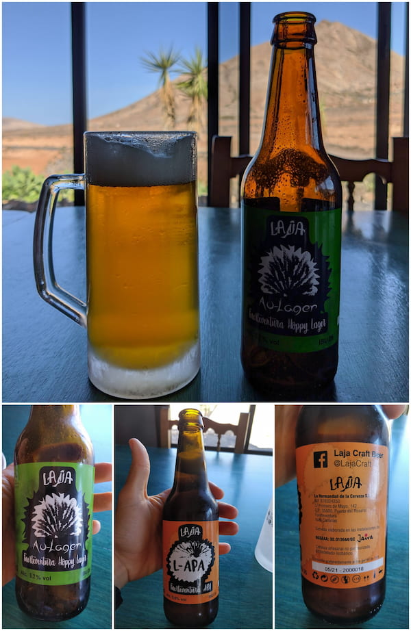

### Cities and towns

Both, the capital **Puerto del Rosario,** and the south of the island are the most tourist areas. To discover local towns you will have to go further into the island.

**Corralejo.** An important port city with extensive fine sand beaches. It is the starting point for boat trips to Lobos _Island (Isla de Lobos)._

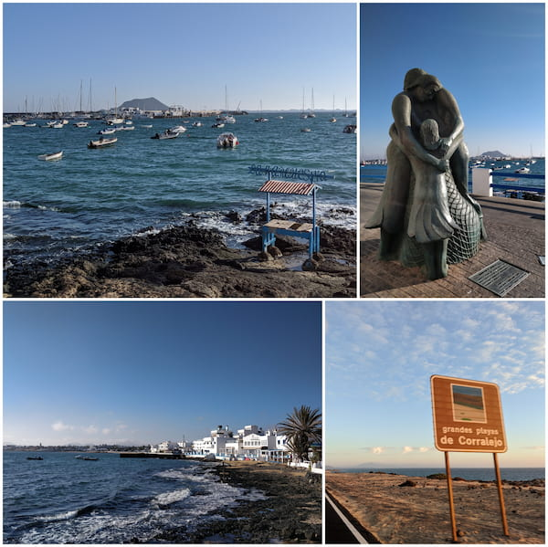

**Betancuria.** It was the ancient capital of Fuerteventura until the 19th century. Declared one of the most beautiful towns in Spain. Worth paying a visit.

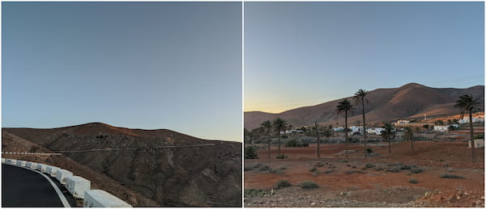

**El Cotillo.** Located in the north as well as Corralejo although smaller than it. El Cotillo is another coastal town great to take a walk and eat local fresh fish.

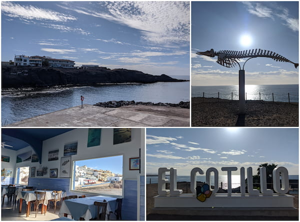

**Ecomuseo De La Alcogida.** In the center of the island, this abandoned group of houses has been transformed into a museum where you can learn about the lives of the inhabitants of Fuerteventura throughout the centuries.

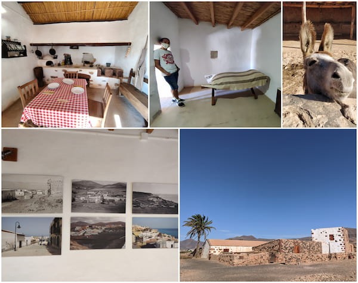

### Nature

**Lobos Island.** A small island between Lanzarote and Fuerteventura. There is a regular maritime transport service that connects it with Corralejo. The beautiful nature is different from the mother island one. You can enjoy beaches with crystal clear waters.

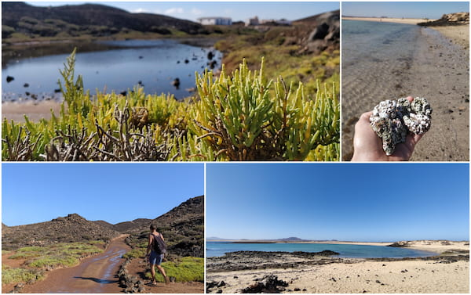

**Cofete beach.** A natural area on the Jandia peninsula. As beautiful as hard to access. This immense coastline virgin of hotels and mass tourism is definitely worth a visit. Don’t forget to check the **Villa Winter** if you get there.

**Barranco de los enamorados.** “Lovers ravine”, Hidden in the middle of the island between El Cotillo and Tindaya. A landscape of fossil dunes that have been carved out by water and shaped by the wind. It is a tradition to engrave your name and your loved one on the wall.

**La Pared.** Located in the southwest of the island this place gathers incredible beaches and viewpoints. Perfect place for sunsets.

## La Gomera

I have not visited this island (yet). However, an easy way to get there is by the ferry in Los Cristianos, Tenerife. The _almogrote_ originated on this island.

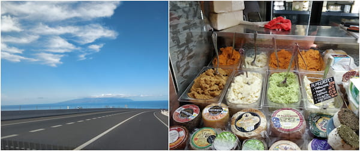

## El Hierro

I have been told it is the most savage one. The least inhabited and the best destination to disconnect from the rest of the world.

## Lanzarote

The closest to the African continent. Named the "Island of Fire" for its volcanic landscapes. Well known as well for its lunar appearance.

## La Graciosa

While writing this guide I discovered in 2018 La Graciosa officially became the eighth Canary Island. One of the reasons I like writing so much; Is one of the best ways to learn.

## Acknowledgments

I was able to write this guide thanks to the wonderful local people from the islands I met while living there and who showed me their paradise in the middle of the Atlantic sea.

In addition, thanks to my best adventures companion those months, Unai. I will never forget all those moments driving and discovering places across the archipelago.

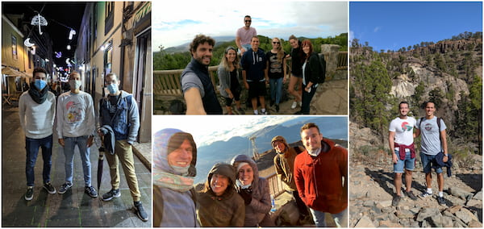
