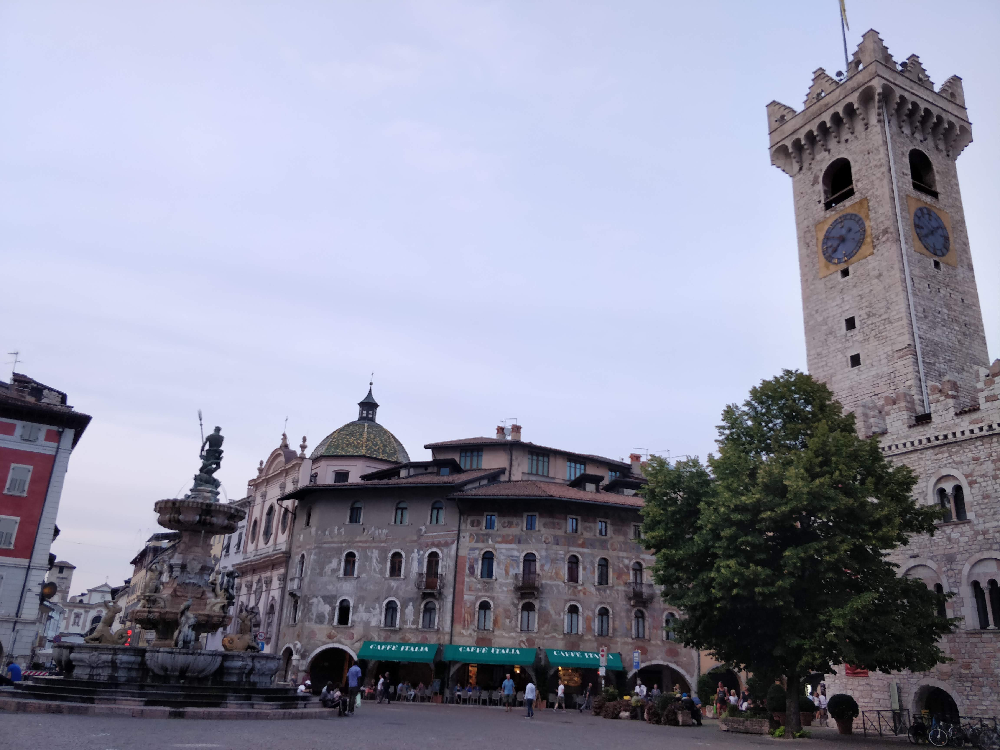
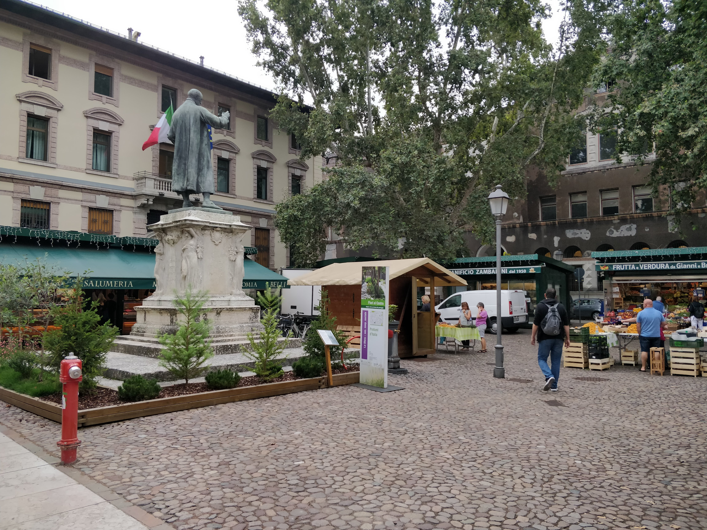
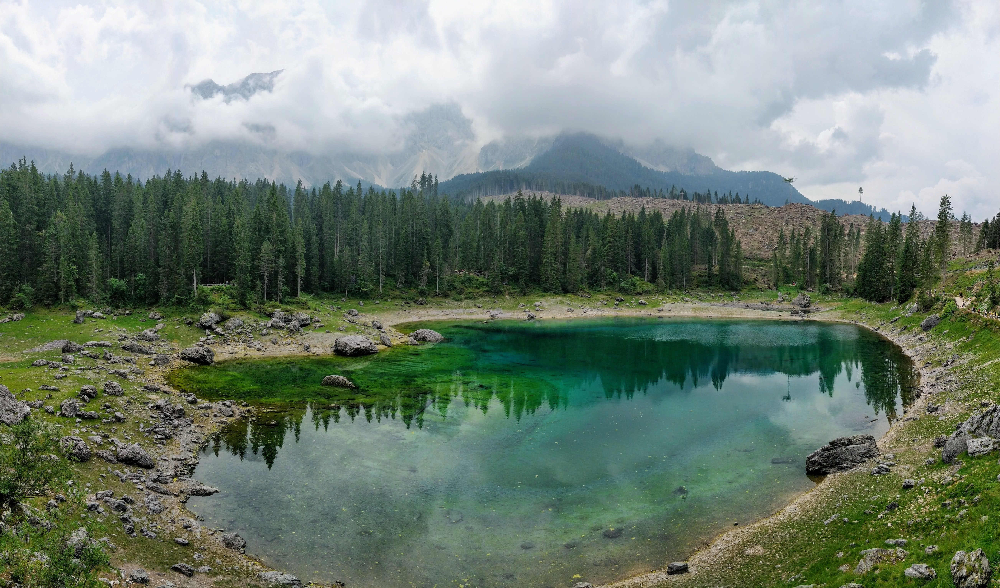
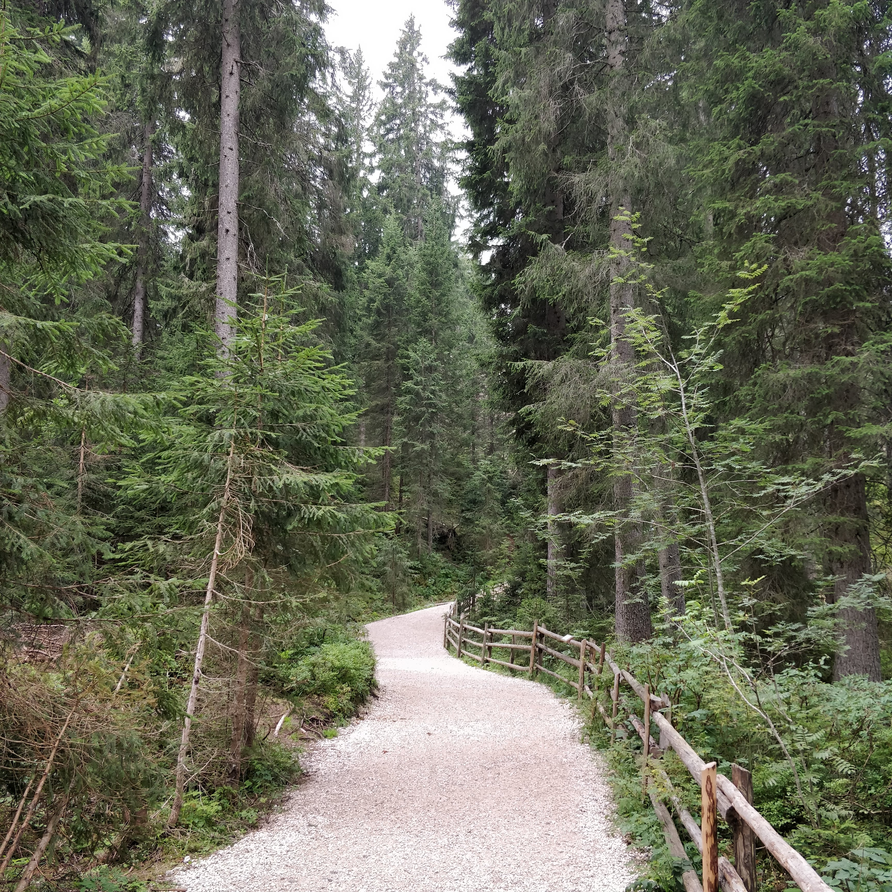
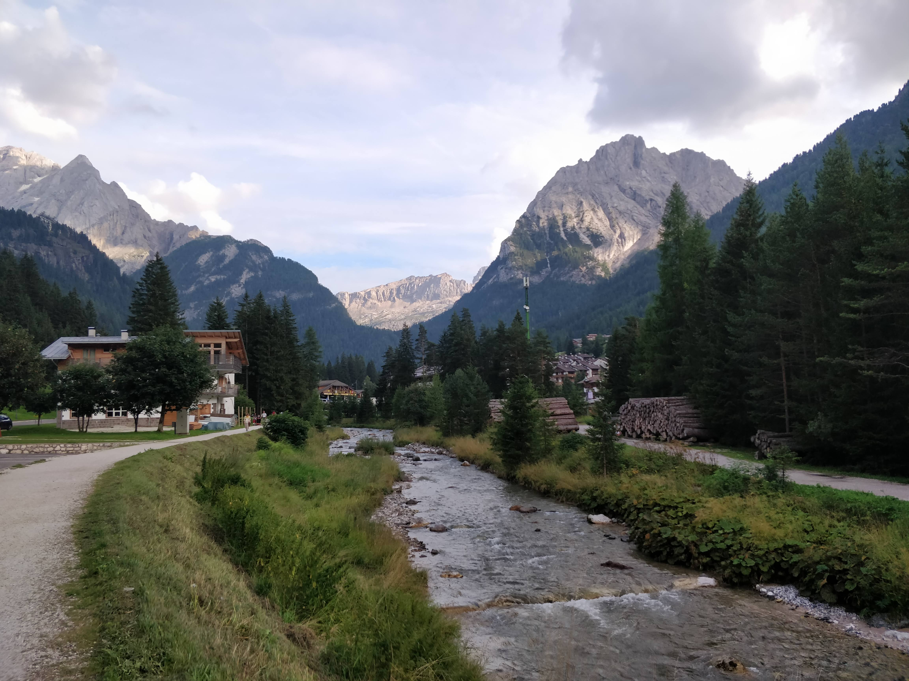
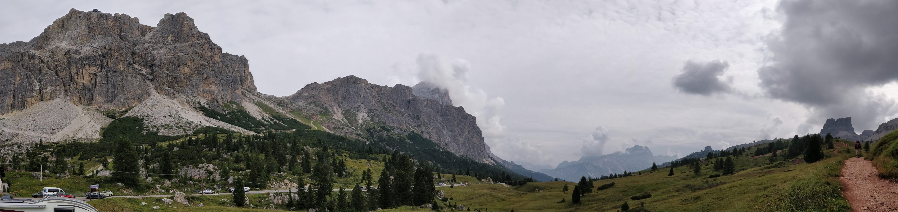

When I told people that I was going to spend some days visiting the Dolomites they had no idea what they were, and, the truth is that neither did I until, a couple of years ago, my mother mentioned that she would like to visit them.

In short, the Dolomites is a mountain range that is part of [the Alps](https://en.wikipedia.org/wiki/Alps). It is located in **northern Italy** in the provinces of Belluno, Bolzano, Trento, Udine, and Pordenone. Although it has many mountains that exceed 3000 m. the highest is the **Marmolada** with **3,342 m**. **They were declared a World Heritage Site by UNESCO in 2009**.

## Table of Contents
- [First day: Trento](#First-day-Trento)
- [Second day: Lago di Carezza](#Second-day-Lago-di-Carezza)
- [Third day: Cortina d'Ampezzo](#Third-day-Cortina-dAmpezzo)
- [Fourth day: Bolzano and Lago di Garda](#Fourth-day-Bolzano-and-Lago-di-Garda)
- [Conclusion](#Conclusion)

## First day: Trento

We left Alicante about 11:00 in the morning and arrive in Milan (Malpensa Airport) at about 13:00. Upon arrival, we picked up a car we had previously rented because although most of the region is well-connected by train and bus, we wanted to **visit places freely and at our pace**.

We rented the car at Autoeurope, a website that I had previously used on a trip to Croatia, and I had a great experience with it. There you can compare and choose from a variety of car rental companies. We (4 people) ended up renting a Golf for 5 days for 120 euros more or less.

We then headed towards Trento on the highway. In Italy the speed limits are:

* **130 km/h** on the highways.
* **110 km/h** on the main roads.
* **90 km/h** on secondary roads
* **50 km/h** in urban areas.

When we arrived at Trento we drove to the hotel which was about 10 minutes by car from the center, on the side of a mountain.

After leaving our luggage, we went down to Trento and parked in one of the **many public car parks** (free after 8) to have a look at the city.

Despite the city was not very big it was full of life and had many charming squares, especially the main one, the _Piazza Duomo_.

## Second day: Lago di Carezza

On the second day, we had our last walk at Trento in the morning and bought some local Italian products at the _[Mercato Giornaliero](https://goo.gl/maps/mN917WdRzk1FuETP9)_. We mainly got cheeses and sausages from the area such as the _Speck_ and some fruits.

> The speck is a ham with a distinctive juniper flavor originating in the historical region of Tyrol, which is cured with salt and smoked. 
> — [Wikipedia](https://es.wikipedia.org/wiki/Speck)

Our next objective was the _[Lago di Carezza](https://goo.gl/maps/ZiktEE5wbXXhT9Cf8)_. The fastest way to get there was heading up to Bolzano and then turn right. We planned to visit Bolzano the last day, so we took a slightly longer route passing through _Pozza di Fassa_.

<iframe src="https://www.google.com/maps/embed?pb=!1m34!1m12!1m3!1d353153.69068352063!2d11.103147546985761!3d46.24996521522647!2m3!1f0!2f0!3f0!3m2!1i1024!2i768!4f13.1!4m19!3e0!4m5!1s0x478276cac9ce9ddb%3A0x27c6a299139ff547!2sTrento%2C%20Province%20of%20Trento%2C%20Italy!3m2!1d46.074779299999996!2d11.1217486!4m5!1s0x477869237b61dcd9%3A0x99d972828b60eebd!2sPozza%20di%20Fassa%2C%2038036%20Province%20of%20Trento%2C%20Italy!3m2!1d46.4306894!2d11.6857172!4m5!1s0x47786fbe51650425%3A0x26e4d13e4445202f!2sLago%20di%20Carezza!3m2!1d46.4104889!2d11.5758269!5e0!3m2!1sen!2ses!4v1567698533267!5m2!1sen!2ses" width="600" height="450" frameborder="0" style="border:0" allowfullscreen=""></iframe>

The lake was stunning, **the water's blue and green colors** are what most caught my attention. In case you are wondering about swimming in it, you will have to find another lake because this one is fenced around to prevent people from littering or destroying it.

We ended up going along a beautiful trail that surrounds it for about half an hour and from which you can see the lake from different points of view.

Later we arrived at Canazei where we would stay the rest of the trip nights. Canazei is a large municipality located in the northern part of the _Val di Fassa_. It is also known as a place for snow tourism and base station for trails and climbs to the _Sella_, _Marmolada_, and _Sassolungo_.

## Third day: Cortina d'Ampezzo

On the third day, we went to _Cortina d’Ampezzo_ not just for seeing the city itself, but for the route with spectacular views through the Dolomites to get to it. In order to see as much as we could, we went and returned by different paths.

On the go, we took passed through _Passo Pordoi_, and _Passo Falzarego_ on the way back we took the route through _Passo di Giau_ and the _Fedaia Lake_. Both routes lasted about 1 hour and 30 minutes each.

<iframe src="https://www.google.com/maps/embed?pb=!1m58!1m12!1m3!1d175825.81720935728!2d11.815877312487777!3d46.48279964344123!2m3!1f0!2f0!3f0!3m2!1i1024!2i768!4f13.1!4m43!3e0!4m5!1s0x47786a694ab62bc3%3A0xcb8e3fb552a4e7e4!2sCanazei%2C%20Trentino%2C%20Italy!3m2!1d46.4767783!2d11.770364899999999!4m5!1s0x47784034607e7663%3A0x81157a992b3a2fc!2sPasso%20Pordoi%2C%2032020%20Province%20of%20Belluno%2C%20Italy!3m2!1d46.487834!2d11.8140476!4m5!1s0x477837f5f673e5eb%3A0xe5210d91f732fe92!2sFalzarego%20Pass%2C%20Cortina%20d&#39;Ampezzo%2C%20Province%20of%20Belluno%2C%20Italy!3m2!1d46.5191252!2d12.0089186!4m5!1s0x47783435d247033f%3A0xdd3c30437b92e42b!2sCortina%20d&#39;Ampezzo%2C%2032043%20Province%20of%20Belluno%2C%20Italy!3m2!1d46.5404711!2d12.1356524!4m5!1s0x477849c8ddb4726f%3A0x6e338788d85b33c1!2sGiau%20Pass%2C%2032046%20San%20Vito%20di%20Cadore%2C%20Province%20of%20Belluno%2C%20Italy!3m2!1d46.4830556!2d12.0541667!4m5!1s0x47784148229089d9%3A0x42b5e7b17c12fccb!2sFedaia%20Lake%2C%20Canazei%2C%20Trentino%2C%20Italy!3m2!1d46.459097299999996!2d11.8702524!4m5!1s0x47786a694ab62bc3%3A0xcb8e3fb552a4e7e4!2sCanazei%2C%20Trentino%2C%20Italy!3m2!1d46.4767783!2d11.770364899999999!5e0!3m2!1sen!2ses!4v1598433772339!5m2!1sen!2ses" width="600" height="450" frameborder="0" style="border:0;" allowfullscreen="" aria-hidden="false" tabindex="0"></iframe>

If you end up renting a car to enjoy the views you will be reassured to know that the vast majority of the roads are well paved and fit two cars although many of them are not delimited by a continuous line in the middle, so **drive carefully and not too fast**.

Cortina d'Ampezzo is larger than Canazei and is a well-known place for winter sports given its ski slopes, landscapes, accommodations, shops. It is very frequented by the international jet-set.

On the way back we passed by *Fedaia Lake* from where we could see the **Marmolada Glacier**. Here are some pictures of both.

## Fourth day: Bolzano and Lago di Garda

The last day we got up early and headed to Bolzano a city on the west of Canazei and north of Trento. One thing that caught my attention is that It is a **bilingual city where both Italian and German languages are spoken**. The most remarkable street is _Via dei Portici_, one of the main streets where shops are located under porticos on both sides.

After leaving Bolzano and on the way to Milan's Airport, we stopped in a couple of villages on the shores of _Lago di Garda_, the **largest lake in Italy**. First, in _Riva del Garda_ and later _Peschiera del Garda_.

Both Riva del Garda and Peschiera del Garda are cities whose **main activity is Tourism**. In Peschiera del Garda this fact was more remarkable than in Riva given numerous restaurants and tourists' shops all around the city.

## Conclusion

After having been in other cities and more popular areas of Italy in the past **this trip was very different and more nature connected** from what I was used to seeing in those areas. The Dolomites are an incredible area that if you have the opportunity to visit you should not miss it, and remember to rent a car if you can afford it to move around them because otherwise, you will probably miss part of the landscapes described above.
