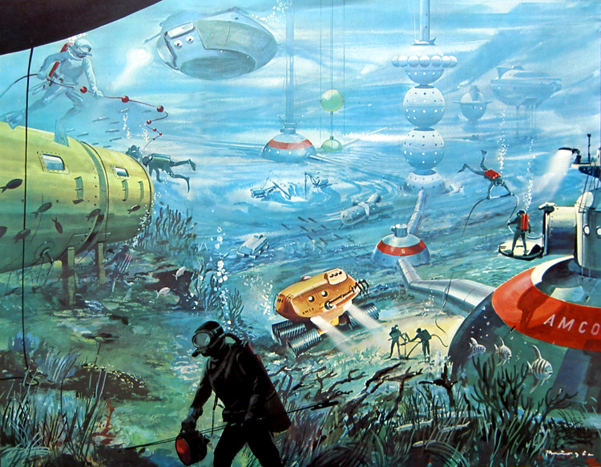

Just as there is the **Physical First Aid** technique that we all have seen or heard about, there is also a _psychological_ one not so well known. It could be said that it is just **as important as the first one.** As a way to introduce this topic and without going deeper into it a simple comparison could be that _unlike Physical First Aid, in the psychological one, you don't wait for an ambulance to arrive._

For this reading, I structured the content in a basic _problem-solving_ way based on the principle of the [Five Ws.](https://en.wikipedia.org/wiki/Five_Ws)

## Table of Contents

- [What is Psychological First Aid](#What-is-Psychological-First-Aid)
- [When to apply it](#When-to-apply-it)
- [How to apply it](#How-to-apply-it)
- [Why apply it](#Why-apply-it)
- [Conclusions](#Conclusions)
- [Resources](#Resources)

## What is Psychological First Aid

**Psychological First Aid is a technique used with people who have just suffered the impact of tragic news, an accident, or have experienced a catastrophe.** People who are in shock and feel vulnerable. They are trying to understand what has happened to them and the consequences of it.

## When to apply it

It is indicated to apply it **from immediately after the impact of what has happened until approximately 72 hours later.** 

This does not mean that after 72 hours the affected do not need help, just that psychological first aid is the proper technique in the first 72 hours after the event.

After a month after the incident, if the person has not recovered from his normal life, it is advisable to go to a doctor.

## How to apply it

Here are **the 5 Psychological First Aid main steps.** The details and applications of each one vary with the patient's age; you don’t calm a baby the same way you do with a teenager or an old man. Anyway, the concept remains the same for any age.

1. **Contain.** First, we have to give the person security, **make them feel safe.** The important point is to try to prevent the person's emotions, fears, feelings from overflowing.
2. **Calm. Help the person relax** speaking in a slow voice, trying to conduct yourself as calmly as possible, lowering our activation tone. We will never tell the person that everything will be better when calmed down because it may not be true.
3. **Inform.** We will not inform the person until it is calmed. We should not explain or give more information than the needed or give morbid details of what has happened. **The shorter an explanation is, the more security it will give.** 

    Listen to what the person tells us without judging and give it the importance it has. It is preferable, to tell them that you do not know something than to tell them something you are not sure which later may not be true. 

4. **Normalize.** Normalize the symptoms and what is happening to the person. Make them see that they are not the only ones who have these feelings or reactions. **Help them realize it is normal to experience those feelings.**
5. **Comfort.** Obviously, we have to **comfort them and give them support.** Try to make them feel useful. However, you have to accept that maybe you are not the one to comfort them the best. In this situation try to find the best way or person to comfort them.

## Why apply it

**Why apply it?** There is no better reason than **to help.** To help those affected to regain control of their life and face what has happened to them with the fewest possible consequences. Reducing the level of stress produced after the impact of the news or traumatic event. Finally, to connect those affected with their support network.

There is another _Why_ for this reading though: **Why I am writing about this subject.** The first reason is that **writing is a very effective way to learn.** Besides, I completed a course recently to learn about the topic and be able to help people in these and similar situations. After the course, I wanted to review and share useful knowledge I learned.

## Conclusions

In the same way as the physical first aid technique, the psychological one can be **decisive to help people** in the first moments they have gone through a tough situation. If we find someone in this situation and apply this technique, we will help them _more efficiently._

## Resources

The majority of the knowledge shared here comes from [the course I completed about Psychological First Aid](https://www.coursera.org/learn/pap-covid19). I have not wanted to extend this article more than necessary, however it also delves into other interesting topics such as [Acute stress disorder](https://en.wikipedia.org/wiki/Acute_stress_disorder), [Post-traumatic stress disorder](https://en.wikipedia.org/wiki/Post-traumatic_stress_disorder), and the relation between each other.

Other topics explained on it are the famous **Defusing** and **Debriefing** techniques from [Critical Incident Stress Management](https://en.wikipedia.org/wiki/Critical_incident_stress_management).

The pictures of the article are related to a recent discovery I made about the [Retrofuturism](https://en.wikipedia.org/wiki/Retrofuturism) movement. I was amazed by its art and for this article I added the pictures I liked the most from its main artists. The cover picture is _The New Universe 76, 1959_ from _Klaus Bürgle._
